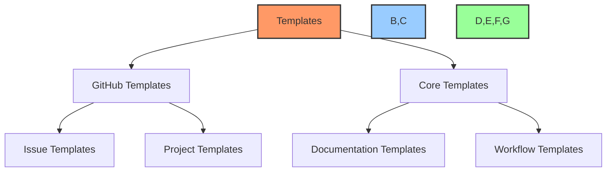
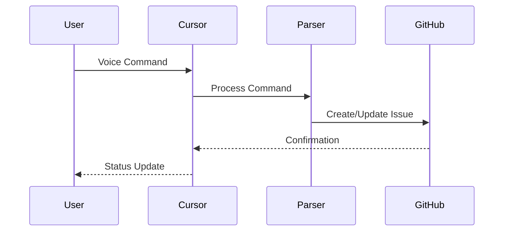
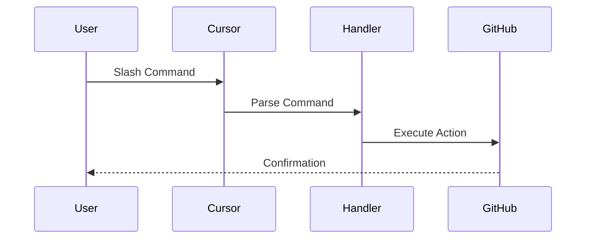
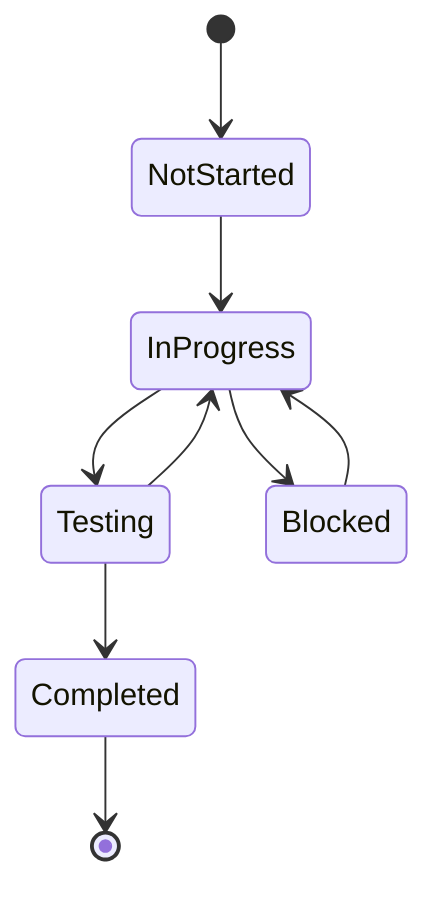

# 🤖 Cursor AI x GitHub Project Automation Toolkit

<div align="center">
  <p float="left">
    
    
  </p>
</div>

## 🎯 Overview
A powerful toolkit that enables seamless task management through Cursor AI's chat and voice prompts, automatically syncing with GitHub Projects. Simply speak or type your tasks into Cursor's chat window, and let the automation handle the rest - from creating issues to updating project boards.

### 🗣️ Key Features
- **Voice Command Integration**: Speak your tasks directly into Cursor
- **Natural Language Processing**: Convert casual prompts into structured tasks
- **Automatic GitHub Sync**: Tasks automatically create issues and update project boards
- **Smart Context Awareness**: Maintains context across conversations
- **Template Automation**: Standardized issue and project templates
- **Real-time Updates**: Instant GitHub project board updates

## 🎤 Voice Command Examples

```bash
# Create a new task
"Create a task to implement user authentication with JWT"

# Update task status
"Mark the authentication task as in progress"

# Add to sprint
"Add the auth task to current sprint"

# Create documentation
"Generate API documentation for auth endpoints"
```

## 💬 Chat Prompt Examples

```markdown
# Task Creation
/task "Implement user authentication"
/priority high
/labels backend, security
/assign @developer

# Status Update
/update TASK-001 "Added JWT implementation"
/status in-progress
/progress 60

# Sprint Management
/sprint add TASK-001
/milestone v1.0
```

## 🚀 Quick Start

1. **Clone the Repository**
```bash
git clone https://github.com/PowerBridge-ai/CURSOR-GITHUB-MCP-GH-CLI-TOOLKIT.git
cd CURSOR-GITHUB-MCP-GH-CLI-TOOLKIT
```

2. **Install Required Tools**
- GitHub CLI (`gh`)
- PowerShell 7+
- Node.js 18+

3. **Configure GitHub CLI**
```bash
gh auth login
```

## 📂 Directory Structure

```
CURSOR-GITHUB-MCP-GH-CLI-TOOLKIT/
├── workflows/                    # Core workflow definitions
│   ├── voice-command-workflow.md # Voice command processing
│   ├── chat-prompt-workflow.md   # Chat prompt processing
│   └── github-sync-workflow.md   # GitHub synchronization
├── templates/                    # Document templates
│   ├── core/                    # Core document templates
│   └── github/                  # GitHub templates
├── scripts/                     # Automation scripts
│   ├── powershell/             # PowerShell automation
│   └── cli/                    # CLI tools and scripts
└── docs/                       # Documentation
```

## 🎯 Voice Command Features

- Natural language task creation
- Status updates via voice
- Sprint management commands
- Documentation generation
- Issue assignment and labeling
- Project board automation

## 💬 Chat Prompt Features

- Slash command support
- Rich text formatting
- Template insertion
- Quick actions
- Context awareness
- Command history

## 📚 Documentation

- [Voice Command Guide](docs/voice-commands.md)
- [Chat Prompt Guide](docs/chat-prompts.md)
- [Workflow Guide](docs/workflow-guide.md)
- [Project Templates](templates/github/project-templates/README.md)

## 🔧 Usage

1. **Start Cursor AI**
```bash
# Open Cursor and enable AI features
cursor --enable-ai
```

2. **Initialize Voice Commands**
```bash
# Set up voice command recognition
./scripts/setup-voice-commands.ps1
```

3. **Configure Chat Prompts**
```bash
# Set up chat prompt handlers
./scripts/setup-chat-prompts.ps1
```

## 🤝 Contributing

1. Fork the repository
2. Create your feature branch
3. Commit your changes
4. Push to the branch
5. Create a new Pull Request

## 📄 License

This project is licensed under the MIT License - see the [LICENSE](LICENSE) file for details.

## ⭐ Support

If you find this toolkit helpful, please consider giving it a star! For issues, questions, or suggestions, please open an issue in the repository.

<div align="center">
  
</div>

---

Made with Power, Love, and AI •  ⚡️❤️🤖 •  POWERBRIDGE.AI

## 📚 Detailed Documentation & Templates

### 🎨 Template Structure


### 📋 Issue Templates

#### 1. 🐛 Bug Report Template
- **Purpose**: Standardized bug reporting
- **Key Sections**:
  - Bug Description
  - Steps to Reproduce
  - Expected vs Current Behavior
  - Environment Details
  - Error Information
  - Test Cases
- **Usage**: `gh issue create --template bug-report.md`

#### 2. ✨ Feature Request Template
- **Purpose**: Structured feature proposals
- **Key Sections**:
  - Feature Description
  - Requirements
  - Implementation Steps
  - UI/UX Requirements
  - Technical Specifications
  - Testing Requirements
- **Usage**: `gh issue create --template feature-request.md`

### 📊 Project Board Templates

#### 1. 🎯 Default Project Board (`default-board.yml`)
```yaml
fields:
  - Status:
      🔴 Not Started
      🟡 In Progress
      🟢 Completed
      ⭕️ Blocked
      🔵 Testing
      ✅ Verified
  - Priority:
      🔥 Critical
      ⚡ High
      📊 Medium
      🔽 Low
```

- **Automation Rules**:
  - Auto-status updates
  - Sprint management
  - Priority tracking
  - Label synchronization

### 📝 Core Documentation Templates

#### 1. 📋 Task Log Template
- **Purpose**: Track task progress
- **Updates**: Daily
- **Key Sections**:
  - Sprint Status
  - Active Tasks
  - Completed Tasks
  - Blocked Items
  - Progress Metrics

#### 2. 🗂️ Dev Notes Template
- **Purpose**: Technical documentation
- **Updates**: With changes
- **Sections**:
  - Architecture Overview
  - Implementation Details
  - API Documentation
  - Performance Metrics

#### 3. 🌲 File Tree Template
- **Purpose**: Project structure
- **Updates**: With changes
- **Features**:
  - Directory mapping
  - Component relationships
  - Implementation status
  - Size metrics

### 🔄 Workflow Documentation

#### 1. 🎤 Voice Command Workflow


#### 2. 💬 Chat Prompt Workflow


#### 3. 🔄 GitHub Sync Workflow
- **Purpose**: Real-time synchronization
- **Features**:
  - Bi-directional updates
  - Status synchronization
  - Label management
  - Project board automation

#### 4. 📝 Documentation Workflow
- **Purpose**: Maintain documentation
- **Components**:
  - Auto-generation
  - Template application
  - Cross-referencing
  - Version tracking

### 🎯 Implementation Examples

#### 1. Voice Command Implementation
```typescript
// Voice command handler
async function handleVoiceCommand(command: string) {
    const parsed = parseNaturalLanguage(command);
    const action = determineAction(parsed);
    await executeGitHubAction(action);
}
```

#### 2. Chat Command Implementation
```typescript
// Chat command handler
async function handleChatCommand(command: string) {
    const [action, ...params] = command.split(' ');
    const handler = commandHandlers[action];
    await handler.execute(params);
}
```

### 📊 Status Tracking

#### Task Status Flow


### 🔍 Template Validation

#### Checklist System
- [ ] Issue template completeness
- [ ] Project board configuration
- [ ] Workflow documentation
- [ ] Command implementation
- [ ] Status synchronization
- [ ] Error handling

