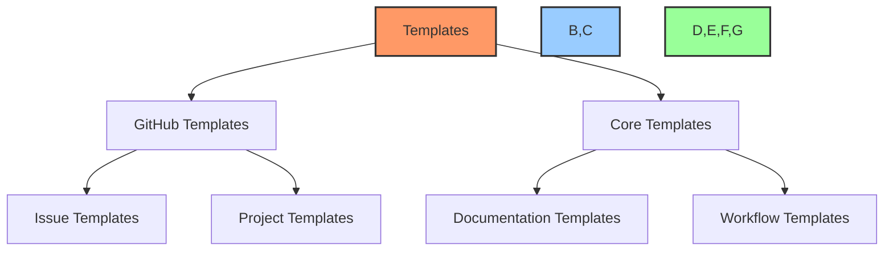
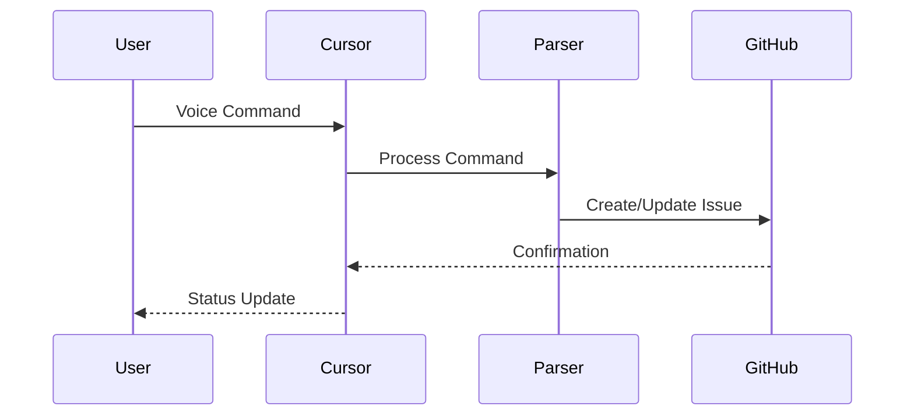
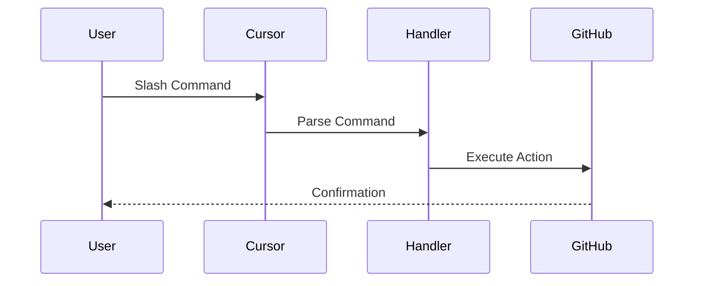
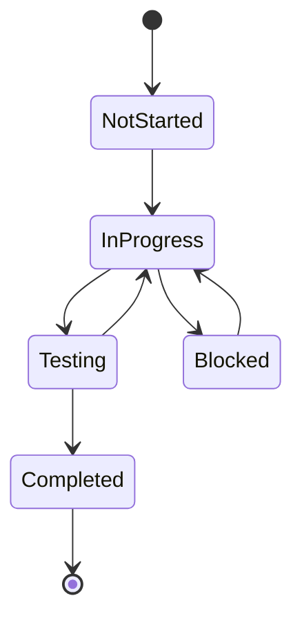

# 🤖 Cursor AI x GitHub Project Automation Toolkit

<div align="center">
  <p float="left">
    
    
  </p>
</div>

## 🎯 Overview
A powerful toolkit that enables seamless task management through Cursor AI's chat and voice prompts, automatically syncing with GitHub Projects. Simply speak or type your tasks into Cursor's chat window, and let the automation handle the rest - from creating issues to updating project boards.

### 🗣️ Key Features
- **Voice Command Integration**: Speak your tasks directly into Cursor
- **Natural Language Processing**: Convert casual prompts into structured tasks
- **Automatic GitHub Sync**: Tasks automatically create issues and update project boards
- **Smart Context Awareness**: Maintains context across conversations
- **Template Automation**: Standardized issue and project templates
- **Real-time Updates**: Instant GitHub project board updates

## 🎤 Voice Command Examples

```bash
# Create a new task
"Create a task to implement user authentication with JWT"

# Update task status
"Mark the authentication task as in progress"

# Add to sprint
"Add the auth task to current sprint"

# Create documentation
"Generate API documentation for auth endpoints"
```

## 💬 Chat Prompt Examples

```markdown
# Task Creation
/task "Implement user authentication"
/priority high
/labels backend, security
/assign @developer

# Status Update
/update TASK-001 "Added JWT implementation"
/status in-progress
/progress 60

# Sprint Management
/sprint add TASK-001
/milestone v1.0
```

## 🚀 Quick Start

1. **Clone the Repository**
```bash
git clone https://github.com/PowerBridge-ai/CURSOR-GITHUB-MCP-GH-CLI-TOOLKIT.git
cd CURSOR-GITHUB-MCP-GH-CLI-TOOLKIT
```

2. **Install Required Tools**
- GitHub CLI (`gh`)
- PowerShell 7+
- Node.js 18+

3. **Configure GitHub CLI**
```bash
gh auth login
```

## 🔌 Required Dependencies

### 🤖 GitHub MCP Server
This toolkit requires the GitHub MCP Server to be installed in Cursor. The MCP Server enables direct integration with GitHub's API through Cursor.

1. Install GitHub MCP Server:
   - Repository: [github-mcp-server](https://github.com/github/github-mcp-server)
   - Follow installation instructions in the repository

### 🔗 Available GitHub MCP Connections

| Category | Command | Description |
|----------|---------|-------------|
| 📝 Issues | `add_issue_comment` | Add a comment to an issue |
| | `create_issue` | Create a new issue |
| | `get_issue` | Get issue details |
| | `get_issue_comments` | Get issue comments |
| | `list_issues` | List repository issues |
| | `update_issue` | Update an existing issue |
| 🔄 Pull Requests | `add_pull_request_review_comment` | Add a review comment |
| | `create_pull_request` | Create a new PR |
| | `create_pull_request_review` | Create a PR review |
| | `get_pull_request` | Get PR details |
| | `get_pull_request_comments` | Get PR comments |
| | `get_pull_request_files` | Get PR changed files |
| | `get_pull_request_reviews` | Get PR reviews |
| | `get_pull_request_status` | Get PR status |
| | `list_pull_requests` | List repository PRs |
| | `merge_pull_request` | Merge a PR |
| | `update_pull_request` | Update a PR |
| | `update_pull_request_branch` | Update PR branch |
| 📂 Repository | `create_branch` | Create a new branch |
| | `create_repository` | Create a new repository |
| | `create_or_update_file` | Create/update a file |
| | `fork_repository` | Fork a repository |
| | `get_commit` | Get commit details |
| | `get_file_contents` | Get file contents |
| | `list_branches` | List repository branches |
| | `list_commits` | List repository commits |
| | `push_files` | Push multiple files |
| 🔍 Search | `search_code` | Search code |
| | `search_issues` | Search issues |
| | `search_repositories` | Search repositories |
| | `search_users` | Search users |
| 🔒 Security | `get_code_scanning_alert` | Get code scanning alert |
| | `get_secret_scanning_alert` | Get secret scanning alert |
| | `list_code_scanning_alerts` | List code scanning alerts |
| | `list_secret_scanning_alerts` | List secret scanning alerts |
| 👤 User | `get_me` | Get authenticated user details |

### 🎯 Voice & Project Management Commands

| Category | Command | Description | Example |
|----------|---------|-------------|----------|
| 📝 Task Management | `create task` | Create a new task or issue | "Create task: Implement user authentication" |
| | `edit task` | Modify existing task details | "Edit task AUTH-001: Update description" |
| | `update task` | Update task progress or details | "Update task AUTH-001: Added JWT implementation" |
| | `delete task` | Remove a task | "Delete task AUTH-001" |
| | `assign task` | Assign task to team member | "Assign task AUTH-001 to @developer" |
| 📊 Status Management | `update status` | Change task status | "Update status of AUTH-001 to in progress" |
| | `mark blocked` | Mark task as blocked | "Mark AUTH-001 as blocked: waiting for API" |
| | `mark complete` | Mark task as complete | "Mark AUTH-001 as complete" |
| | `set priority` | Set task priority | "Set AUTH-001 priority to high" |
| 🏃 Sprint Management | `add to sprint` | Add task to current sprint | "Add AUTH-001 to current sprint" |
| | `remove from sprint` | Remove task from sprint | "Remove AUTH-001 from sprint" |
| | `move to sprint` | Move task to different sprint | "Move AUTH-001 to next sprint" |
| | `set sprint goal` | Set or update sprint goal | "Set sprint goal: Complete auth system" |
| 🏷️ Labels & Tags | `add label` | Add label to task | "Add label security to AUTH-001" |
| | `remove label` | Remove label from task | "Remove label frontend from AUTH-001" |
| | `set type` | Set task type | "Set AUTH-001 type to feature" |
| 📅 Timeline Management | `set deadline` | Set task deadline | "Set AUTH-001 deadline to next Friday" |
| | `set milestone` | Set task milestone | "Set AUTH-001 milestone to v1.0" |
| | `update timeline` | Update task timeline | "Update AUTH-001 timeline: needs 2 more days" |
| 📊 Project Management | `create project` | Create new project | "Create project: Authentication System" |
| | `set project status` | Update project status | "Update project Auth System status to active" |
| | `add project member` | Add member to project | "Add @developer to Auth System project" |
| 📝 Documentation | `generate docs` | Generate documentation | "Generate API docs for auth endpoints" |
| | `update docs` | Update documentation | "Update AUTH-001 documentation with new endpoints" |
| | `add notes` | Add development notes | "Add notes to AUTH-001: JWT implementation details" |
| 🔍 Search & Filter | `find task` | Search for tasks | "Find all tasks labeled security" |
| | `show blocked` | Show blocked tasks | "Show all blocked tasks in current sprint" |
| | `list tasks` | List tasks by criteria | "List all high priority tasks" |
| 📈 Progress Tracking | `show progress` | Show task/project progress | "Show progress on AUTH-001" |
| | `generate report` | Generate progress report | "Generate sprint progress report" |
| | `show metrics` | Display project metrics | "Show metrics for current sprint" |

<<<<<<< HEAD
=======
## 📚 Documentation

### 🎯 Core Guides
- [Project Creation Guide](docs/project-creation-guide.md) - Complete guide for setting up new projects
- [Documentation Standards](docs/documentation-standards.md) - Standards for maintaining documentation
- [GitHub Project Automation](docs/github-project-automation.md) - Detailed automation workflows
- [Voice Command Guide](docs/voice-commands.md) - Using voice commands with Cursor
- [Chat Prompt Guide](docs/chat-prompts.md) - Using chat commands with Cursor
- [Workflow Guide](docs/workflow-guide.md) - General workflow documentation

### 📋 Templates
- [Project Templates](templates/github/project-templates/README.md) - GitHub project templates
- [Issue Templates](templates/github/issue-templates/README.md) - Standard issue templates
- [Workflow Templates](templates/github/workflow-templates/README.md) - GitHub Actions workflows

### 🔧 Technical Documentation
- [API Integration Guide](docs/technical/api-integration.md) - GitHub API integration details
- [Voice Processing Guide](docs/technical/voice-processing.md) - Voice command processing
- [Chat Processing Guide](docs/technical/chat-processing.md) - Chat command processing
- [Project Board Automation](docs/technical/project-automation.md) - Board automation details

### 🔄 Workflow Documentation
- [Task Management Workflow](docs/workflows/task-workflow.md) - Task creation and management
- [Documentation Workflow](docs/workflows/documentation-workflow.md) - Documentation maintenance
- [Project Board Workflow](docs/workflows/project-board-workflow.md) - Board management
- [Integration Workflow](docs/workflows/integration-workflow.md) - System integration

### 📊 Development Resources
- [Development Guide](docs/development/getting-started.md) - Getting started guide
- [Contributing Guide](docs/development/contributing.md) - Contribution guidelines
- [Testing Guide](docs/development/testing.md) - Testing procedures
- [Deployment Guide](docs/development/deployment.md) - Deployment instructions

### 🎓 Tutorials
- [Quick Start Tutorial](docs/tutorials/quick-start.md) - Getting started quickly
- [Voice Command Tutorial](docs/tutorials/voice-commands.md) - Using voice commands
- [Project Setup Tutorial](docs/tutorials/project-setup.md) - Setting up a new project
- [Automation Tutorial](docs/tutorials/automation.md) - Setting up automation

>>>>>>> 77b85bc ( Update documentation, workflows, and scripts for project automation toolkit)
## 📂 Directory Structure

```
CURSOR-GITHUB-MCP-GH-CLI-TOOLKIT/
├── workflows/                    # Core workflow definitions
│   ├── voice-command-workflow.md # Voice command processing
│   ├── chat-prompt-workflow.md   # Chat prompt processing
│   └── github-sync-workflow.md   # GitHub synchronization
├── templates/                    # Document templates
│   ├── core/                    # Core document templates
│   └── github/                  # GitHub templates
├── scripts/                     # Automation scripts
│   ├── powershell/             # PowerShell automation
│   └── cli/                    # CLI tools and scripts
└── docs/                       # Documentation
```

## 🎯 Voice Command Features

- Natural language task creation
- Status updates via voice
- Sprint management commands
- Documentation generation
- Issue assignment and labeling
- Project board automation

## 💬 Chat Prompt Features

- Slash command support
- Rich text formatting
- Template insertion
- Quick actions
- Context awareness
- Command history

<<<<<<< HEAD
## 📚 Documentation

- [Voice Command Guide](docs/voice-commands.md)
- [Chat Prompt Guide](docs/chat-prompts.md)
- [Workflow Guide](docs/workflow-guide.md)
- [Project Templates](templates/github/project-templates/README.md)

## 🔧 Usage

1. **Start Cursor AI**
```bash
# Open Cursor and enable AI features
cursor --enable-ai
```

2. **Initialize Voice Commands**
```bash
# Set up voice command recognition
./scripts/setup-voice-commands.ps1
```

3. **Configure Chat Prompts**
```bash
# Set up chat prompt handlers
./scripts/setup-chat-prompts.ps1
```

## 📚 Detailed Documentation & Templates

### 🎨 Template Structure
=======
## 🎨 Template Structure


## 📋 Issue Templates

#### 1. 🐛 Bug Report Template
- **Purpose**: Standardized bug reporting
- **Key Sections**:
  - Bug Description
  - Steps to Reproduce
  - Expected vs Current Behavior
  - Environment Details
  - Error Information
  - Test Cases
- **Usage**: `gh issue create --template bug-report.md`

#### 2. ✨ Feature Request Template
- **Purpose**: Structured feature proposals
- **Key Sections**:
  - Feature Description
  - Requirements
  - Implementation Steps
  - UI/UX Requirements
  - Technical Specifications
  - Testing Requirements
- **Usage**: `gh issue create --template feature-request.md`

## 📊 Project Board Templates

#### 1. 🎯 Default Project Board (`default-board.yml`)
```yaml
fields:
  - Status:
      🔴 Not Started
      🟡 In Progress
      🟢 Completed
      ⭕️ Blocked
      🔵 Testing
      ✅ Verified
  - Priority:
      🔥 Critical
      ⚡ High
      📊 Medium
      🔽 Low
```

- **Automation Rules**:
  - Auto-status updates
  - Sprint management
  - Priority tracking
  - Label synchronization

## 📝 Core Documentation Templates

#### 1. 📋 Task Log Template
- **Purpose**: Track task progress
- **Updates**: Daily
- **Key Sections**:
  - Sprint Status
  - Active Tasks
  - Completed Tasks
  - Blocked Items
  - Progress Metrics

#### 2. 🗂️ Dev Notes Template
- **Purpose**: Technical documentation
- **Updates**: With changes
- **Sections**:
  - Architecture Overview
  - Implementation Details
  - API Documentation
  - Performance Metrics

#### 3. 🌲 File Tree Template
- **Purpose**: Project structure
- **Updates**: With changes
- **Features**:
  - Directory mapping
  - Component relationships
  - Implementation status
  - Size metrics

## 🔄 Workflow Documentation

#### 1. 🎤 Voice Command Workflow


#### 2. 💬 Chat Prompt Workflow


#### 3. 🔄 GitHub Sync Workflow
- **Purpose**: Real-time synchronization
- **Features**:
  - Bi-directional updates
  - Status synchronization
  - Label management
  - Project board automation

#### 4. 📝 Documentation Workflow
- **Purpose**: Maintain documentation
- **Components**:
  - Auto-generation
  - Template application
  - Cross-referencing
  - Version tracking

## 🎯 Implementation Examples

#### 1. Voice Command Implementation
```typescript
// Voice command handler
async function handleVoiceCommand(command: string) {
    const parsed = parseNaturalLanguage(command);
    const action = determineAction(parsed);
    await executeGitHubAction(action);
}
```

#### 2. Chat Command Implementation
```typescript
// Chat command handler
async function handleChatCommand(command: string) {
    const [action, ...params] = command.split(' ');
    const handler = commandHandlers[action];
    await handler.execute(params);
}
```
## 📊 Status Tracking

#### Task Status Flow


## 🔍 Template Validation

#### Checklist System
- [ ] Issue template completeness
- [ ] Project board configuration
- [ ] Workflow documentation
- [ ] Command implementation
- [ ] Status synchronization
- [ ] Error handling

## 🤝 Contributing

1. Fork the repository
2. Create your feature branch
3. Commit your changes
4. Push to the branch
5. Create a new Pull Request

## 📄 License

This project is licensed under the MIT License - see the [LICENSE](LICENSE) file for details.

## ⭐ Support

If you find this toolkit helpful, please consider giving it a star! For issues, questions, or suggestions, please open an issue in the repository.

<div align="center">
  
</div>

---

Made with Power, Love, and AI •  ⚡️❤️🤖 •  POWERBRIDGE.AI

Need help with your ai project, docs, or automation?

Contact us at: Email: powerbridge.ai@gmail.com or visit us at: https://powerbridge.ai


