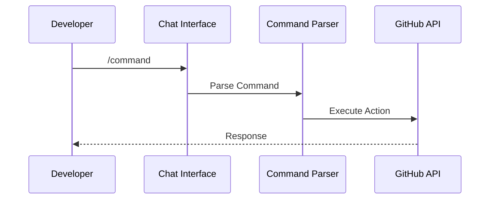
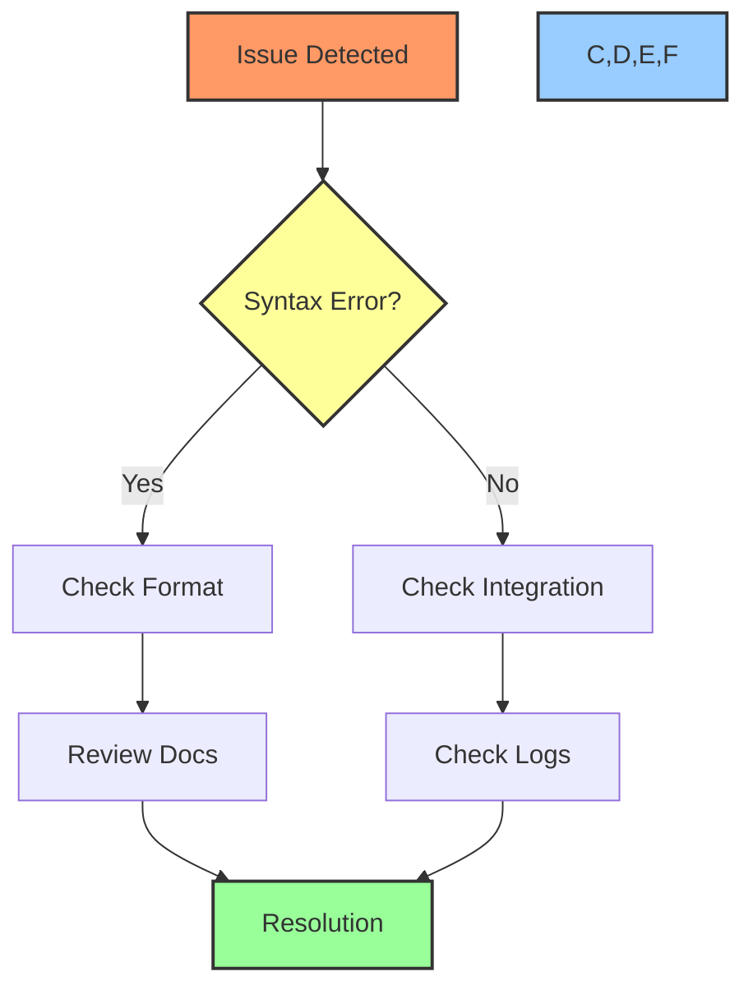

# 💬 Chat Commands Guide

## 📋 Table of Contents
- [Overview](#overview)
- [Command Structure](#command-structure)
- [Available Commands](#available-commands)
- [Command Examples](#command-examples)
- [Advanced Usage](#advanced-usage)
- [Command Customization](#command-customization)
- [Troubleshooting](#troubleshooting)
- [Best Practices](#best-practices)

## 🔍 Overview

This guide explains how to use chat commands in Cursor AI to manage GitHub projects. Chat commands provide a text-based interface for project management, offering precise control and advanced options for task management and automation.

## 🎯 Command Structure

### Basic Command Format
```bash
/command [subcommand] [target] [--options]
```

### Command Flow


## 📝 Available Commands

### Task Management
| Command | Options | Description |
|---------|---------|-------------|
| `/task create` | `--title`, `--body`, `--labels` | Create new task |
| `/task update` | `--status`, `--assignee` | Update task |
| `/task delete` | `--force` | Delete task |
| `/task assign` | `--to`, `--notify` | Assign task |

### Project Management
| Command | Options | Description |
|---------|---------|-------------|
| `/project create` | `--name`, `--template` | Create project |
| `/project status` | `--format` | Show status |
| `/project add` | `--item`, `--column` | Add to project |
| `/project move` | `--from`, `--to` | Move items |

### Sprint Management
| Command | Options | Description |
|---------|---------|-------------|
| `/sprint create` | `--name`, `--duration` | Create sprint |
| `/sprint add` | `--task`, `--priority` | Add to sprint |
| `/sprint start` | `--notify` | Start sprint |
| `/sprint end` | `--report` | End sprint |

## 💡 Command Examples

### Task Management
```bash
# Create task
/task create --title "Implement JWT Auth" --labels security,backend

# Update task
/task update AUTH-001 --status "In Progress" --assignee @developer

# Quick task
/task quick "Fix login bug" --priority high
```

### Project Organization
```bash
# Create project
/project create "Authentication System" --template kanban

# Add to project
/project add AUTH-001 --column "In Progress"

# Move task
/project move AUTH-001 --to "Review"
```

### Sprint Management
```bash
# Create sprint
/sprint create "Sprint 1" --duration 2w

# Add to sprint
/sprint add AUTH-001 --priority high

# Start sprint
/sprint start --notify team
```

## 🔧 Advanced Usage

### Command Chaining
```bash
# Create and assign task
/task create "Setup CI/CD" --labels devops && /task assign latest --to @devops-team

# Create and add to sprint
/task create "API Documentation" && /sprint add latest
```

### Bulk Operations
```bash
# Move multiple tasks
/project move --tasks AUTH-001,AUTH-002 --to "Done"

# Assign multiple tasks
/task assign --tasks AUTH-001,AUTH-002 --to @developer
```

## ⚙️ Command Customization

### Custom Command Template
```typescript
interface CustomCommand {
    name: string;
    description: string;
    options: CommandOption[];
    handler: (args: string[]) => Promise<void>;
}

interface CommandOption {
    name: string;
    type: 'string' | 'boolean' | 'number';
    required: boolean;
    description: string;
}
```

### Creating Custom Commands
```typescript
const deployCommand: CustomCommand = {
    name: 'deploy',
    description: 'Deploy to environment',
    options: [
        {
            name: 'env',
            type: 'string',
            required: true,
            description: 'Target environment'
        }
    ],
    handler: async (args) => {
        // Implementation
    }
};
```

## ❗ Troubleshooting

### Common Issues

1. **Command Syntax**:
   - Check command format
   - Verify option names
   - Ensure required options
   - Check value formats

2. **Execution Issues**:
   - Verify permissions
   - Check GitHub connection
   - Review error messages
   - Validate references

3. **Integration Issues**:
   - Check GitHub CLI setup
   - Verify API tokens
   - Review configurations

### Debug Process


## ✅ Best Practices

### Command Usage
1. Use clear, descriptive commands
2. Include required options
3. Follow naming conventions
4. Verify before execution

### Workflow Integration
1. Use command chaining for complex operations
2. Combine with voice commands
3. Use templates for common tasks
4. Keep commands organized

### Error Prevention
1. Use command completion
2. Review command preview
3. Test in safe environment
4. Document custom commands

## 🔗 Related Documentation
- [Voice Command Guide](voice-commands.md)
- [Project Creation Guide](project-creation-guide.md)
- [GitHub Project Automation](github-project-automation.md)

---

Made with Power, Love, and AI •  ⚡️❤️�� •  POWERBRIDGE.AI