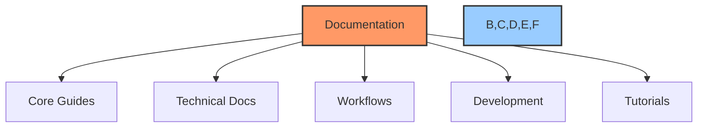
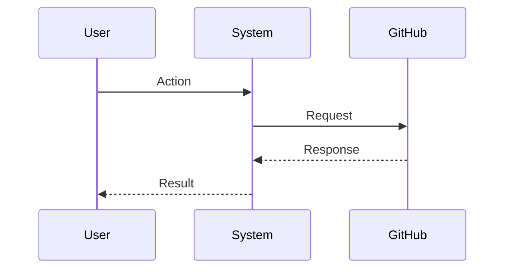

# 📝 Documentation Standards Guide

## 📋 Table of Contents
- [Overview](#overview)
- [Core Standards](#core-standards)
- [Document Structure](#document-structure)
- [Formatting Guidelines](#formatting-guidelines)
- [Emoji Usage](#emoji-usage)
- [Diagrams & Visuals](#diagrams--visuals)
- [Code Examples](#code-examples)
- [Cross-Referencing](#cross-referencing)
- [File Organization](#file-organization)
- [Quality Checklist](#quality-checklist)

## 🔍 Overview

This guide establishes the documentation standards for the Cursor AI x GitHub Project Automation Toolkit. Following these standards ensures consistency, clarity, and maintainability across all project documentation.

## 🎯 Core Standards

### Required Elements
1. Emoji indicators for all sections
2. Table of contents for documents > 3 sections
3. Mermaid diagrams for workflows
4. Code examples with syntax highlighting
5. Cross-references to related documentation
6. Status indicators where applicable

### Document Categories


## 📑 Document Structure

### Required Sections
1. **Title with Emoji**: `# 📝 Document Title`
2. **Table of Contents**: For documents > 3 sections
3. **Overview**: Brief introduction
4. **Main Content**: Organized in logical sections
5. **Related Documentation**: Links to related docs
6. **PowerBridge.AI Signature**: Standard footer

### Header Hierarchy
```markdown
# 📝 Main Title (H1)
## 🔍 Major Section (H2)
### 📊 Subsection (H3)
#### 🛠️ Minor Section (H4)
```

## ✨ Formatting Guidelines

### Text Formatting
- **Bold** for emphasis
- *Italic* for new terms
- `code` for technical terms
- > Blockquotes for important notes

### Lists
- Use `-` for unordered lists
- Use `1.` for ordered lists
- Maintain consistent indentation

### Code Blocks
````markdown
```language
# Code with syntax highlighting
function example() {
    return "Hello World";
}
```
````

## 😀 Emoji Usage

### Standard Emoji Key
| Category | Emoji | Usage |
|----------|-------|-------|
| Documentation | 📝 | Documentation files |
| Overview | 🔍 | Introduction sections |
| Core Feature | ⭐ | Key features |
| Technical | 🔧 | Technical details |
| Tutorial | 📚 | Learning materials |
| Warning | ⚠️ | Important warnings |
| Success | ✅ | Completed items |
| Pending | 🟡 | In-progress items |
| Not Started | 🔴 | Todo items |

### Status Indicators
- 🔴 Not Started
- 🟡 In Progress
- 🟢 Completed
- ⭕️ Blocked
- 🔵 Testing
- ✅ Verified

## 📊 Diagrams & Visuals

### Mermaid Diagrams
Use Mermaid for:
- Workflows
- Architecture diagrams
- Process flows
- State diagrams

Example:


## 💻 Code Examples

### Format
```markdown
```language
# Include language for syntax highlighting
# Add descriptive comments
# Keep examples concise
```
```

### Best Practices
1. Use real, working code
2. Include comments
3. Show input/output
4. Highlight key parts

## 🔗 Cross-Referencing

### Internal Links
```markdown
[Link Text](relative/path/to/file.md#section)
```

### External Links
```markdown
[Link Text](https://external-url.com)
```

### Section Links
```markdown
[Go to Section](#section-name)
```

## 📁 File Organization

### Directory Structure
```
docs/
├── core/           # Core documentation
├── technical/      # Technical details
├── workflows/      # Process workflows
├── development/    # Dev resources
└── tutorials/      # Learning materials
```

### File Naming
- Use kebab-case: `file-name.md`
- Be descriptive: `api-integration-guide.md`
- Include category: `workflow-task-management.md`

## ✅ Quality Checklist

Before submitting documentation:

- [ ] Follows standard structure
- [ ] Includes all required sections
- [ ] Uses proper emoji indicators
- [ ] Contains relevant diagrams
- [ ] Includes code examples
- [ ] Has proper cross-references
- [ ] Passes markdown linting
- [ ] Includes PowerBridge.AI signature

## 🔗 Related Documentation
- [Project Creation Guide](project-creation-guide.md)
- [Documentation Workflow](workflows/documentation-workflow.md)
- [Core Templates](../templates/core/README.md)

---

Made with Power, Love, and AI •  ⚡️❤️🤖 •  POWERBRIDGE.AI
