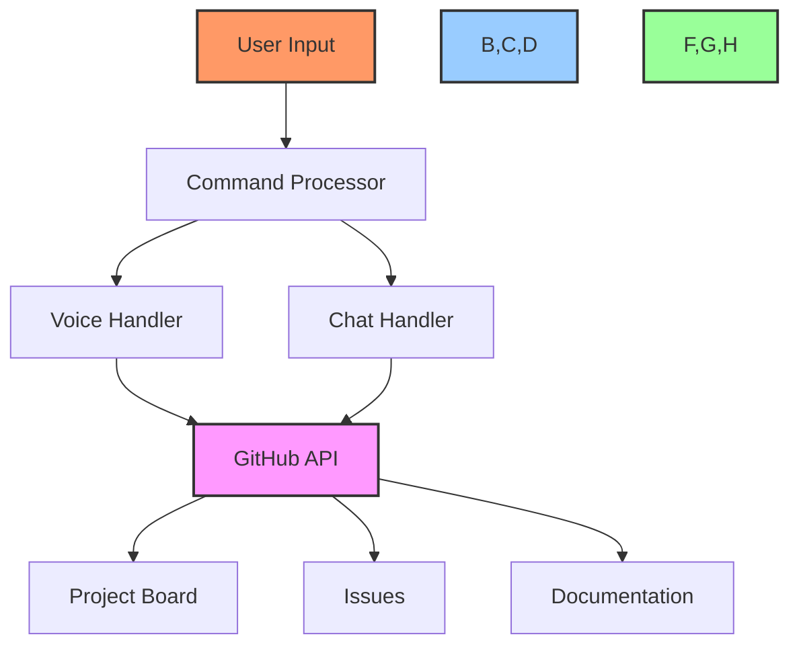
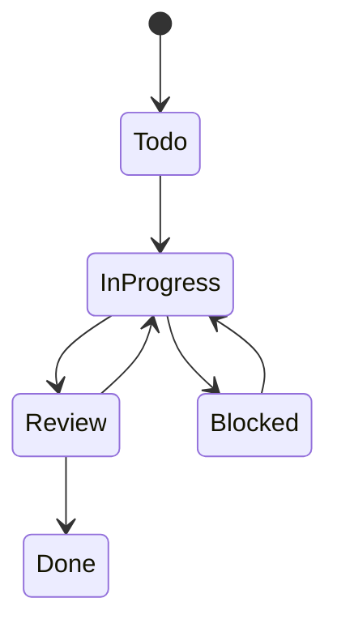
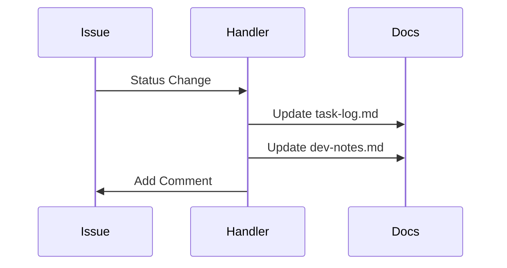
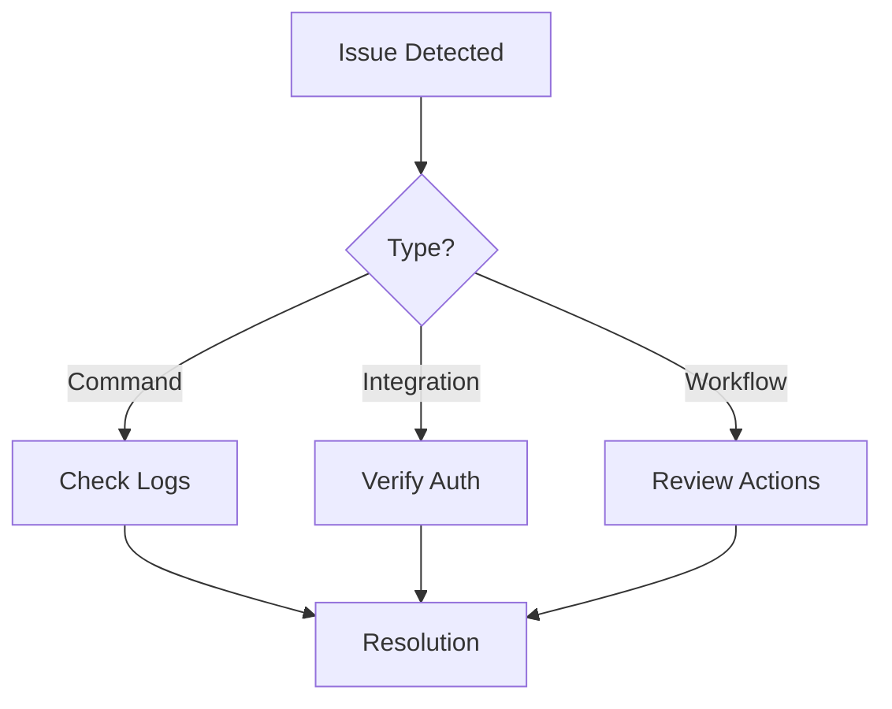

# 🤖 GitHub Project Automation Guide

## 📋 Table of Contents
- [Overview](#overview)
- [Automation Components](#automation-components)
- [Voice Command Integration](#voice-command-integration)
- [Chat Command Integration](#chat-command-integration)
- [Project Board Automation](#project-board-automation)
- [Issue Management](#issue-management)
- [Documentation Sync](#documentation-sync)
- [Workflow Automation](#workflow-automation)
- [Custom Automation](#custom-automation)
- [Troubleshooting](#troubleshooting)

## 🔍 Overview

This guide explains how to use and customize the automated GitHub project management features of the Cursor AI x GitHub Project Automation Toolkit. The system integrates voice commands, chat interactions, and automated workflows to streamline project management.

## 🎯 Automation Components

### System Architecture


## 🎤 Voice Command Integration

### Command Structure
```typescript
interface VoiceCommand {
    action: 'create' | 'update' | 'delete' | 'move';
    target: 'task' | 'issue' | 'project' | 'board';
    parameters: {
        title?: string;
        description?: string;
        status?: string;
        assignee?: string;
        labels?: string[];
    };
}
```

### Example Commands
```bash
# Create new task
"Create task: Implement user authentication"

# Update status
"Move task AUTH-001 to in progress"

# Assign task
"Assign AUTH-001 to @developer"
```

## 💬 Chat Command Integration

### Command Format
```bash
/command [target] [parameters...]
```

### Available Commands
| Command | Description | Example |
|---------|-------------|---------|
| `/task` | Create task | `/task "Add login form" --priority high` |
| `/update` | Update item | `/update AUTH-001 --status done` |
| `/move` | Move item | `/move AUTH-001 to "In Progress"` |
| `/assign` | Assign item | `/assign AUTH-001 to @developer` |

## 📊 Project Board Automation

### Automated Workflows


### Configuration
```yaml
# .github/workflows/project-automation.yml
name: Project Board Automation
on:
  issues:
    types: [opened, closed, reopened]
  pull_request:
    types: [opened, closed, reopened]

jobs:
  automate_projects:
    runs-on: ubuntu-latest
    steps:
      - uses: actions/checkout@v2
      - name: Automate Project Cards
        uses: ./actions/project-automation
        with:
          github-token: ${{ secrets.GITHUB_TOKEN }}
```

## 📝 Issue Management

### Automated Issue Creation
```typescript
async function createIssue(command: VoiceCommand | ChatCommand) {
    const issue = await github.issues.create({
        owner: 'PowerBridge-ai',
        repo: 'my-project',
        title: command.parameters.title,
        body: generateIssueBody(command),
        labels: command.parameters.labels
    });
    return issue;
}
```

### Issue Templates
```markdown
# Issue Template
## Description
[Description from command]

## Acceptance Criteria
- [ ] Criterion 1
- [ ] Criterion 2

## Technical Notes
- Implementation details
- Dependencies
```

## 🔄 Documentation Sync

### Automated Updates


### Sync Process
1. Monitor issue/PR events
2. Parse changes
3. Update relevant docs
4. Add confirmation comment

## ⚡ Workflow Automation

### GitHub Actions Integration
```yaml
# .github/workflows/main.yml
name: Main Workflow
on:
  issues:
    types: [opened, edited, closed]
  pull_request:
    types: [opened, edited, closed]

jobs:
  process:
    runs-on: ubuntu-latest
    steps:
      - uses: actions/checkout@v2
      - name: Process Changes
        uses: ./actions/process-changes
        with:
          token: ${{ secrets.GITHUB_TOKEN }}
```

## 🛠️ Custom Automation

### Creating Custom Commands
```typescript
// custom-commands.ts
interface CustomCommand {
    name: string;
    description: string;
    handler: (params: any) => Promise<void>;
}

const commands: CustomCommand[] = [
    {
        name: 'sprint',
        description: 'Manage sprint tasks',
        handler: async (params) => {
            // Implementation
        }
    }
];
```

### Adding New Workflows
1. Create workflow file
2. Define triggers
3. Implement actions
4. Test automation
5. Deploy changes

## ❗ Troubleshooting

### Common Issues

1. **Command Recognition**:
   - Check command format
   - Verify voice input
   - Review chat syntax

2. **GitHub Integration**:
   - Verify tokens
   - Check permissions
   - Review API limits

3. **Workflow Issues**:
   - Check action logs
   - Verify triggers
   - Review configurations

### Debug Process


## 🔗 Related Documentation
- [Project Creation Guide](project-creation-guide.md)
- [Voice Command Guide](voice-commands.md)
- [Chat Command Guide](chat-prompts.md)

---

Made with Power, Love, and AI •  ⚡️❤️�� •  POWERBRIDGE.AI