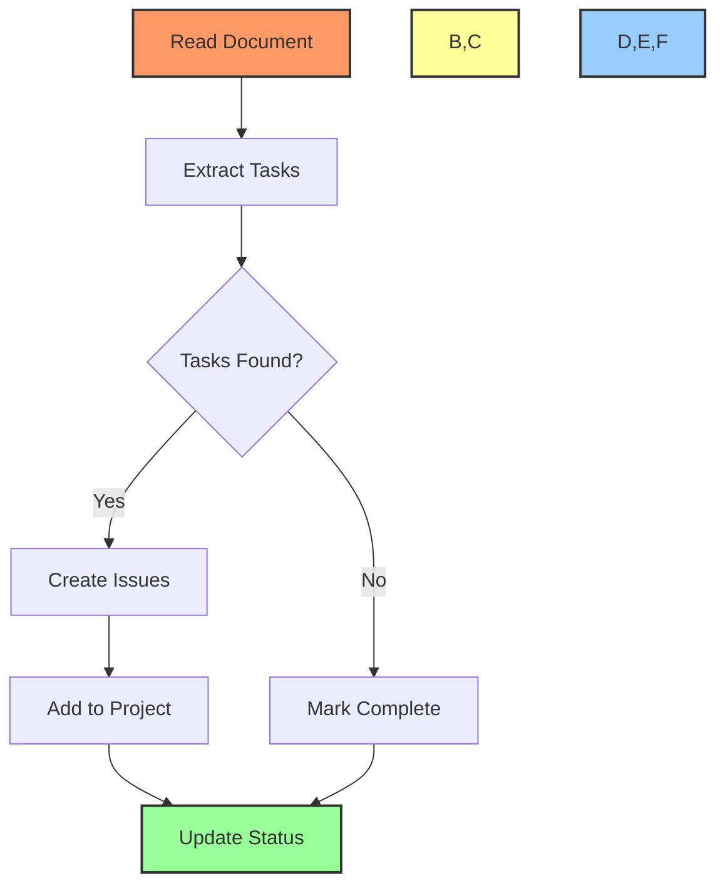
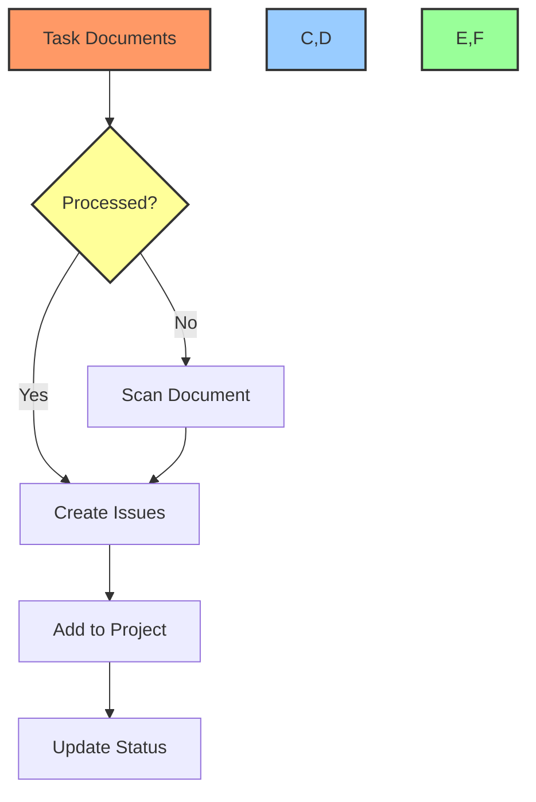

# 📊 Project Management Task Log

## 📋 Table of Contents
- [🎯 Purpose](#purpose)
- [📝 Task Integration Checklist](#task-integration-checklist)
- [🔄 Project Creation Guide](#project-creation-guide)
- [📊 Project Status](#project-status)

## 🎯 Purpose

This document tracks the process of integrating tasks from various documentation files into GitHub projects, including:
- Task migration status
- Project creation and setup
- Integration verification
- Status tracking

## 📝 Task Integration Checklist

### 1. Document Processing Status
Track the integration status of each task document:

| Document | Status | Tasks Found | Tasks Migrated | Project |
|----------|--------|-------------|----------------|----------|
| `DEV/task-log.md` | 🔄 In Progress | 0 | 0 | GainChain AI |
| `src/dev/task-log.md` | 🔴 Not Started | 0 | 0 | GainChain AI |
| `docs/task-list.md` | 🔴 Not Started | 0 | 0 | GainChain AI |

### 2. Integration Process
For each document:



### 3. Task Migration Steps
For each task found:

- [ ] Create GitHub issue
- [ ] Add to appropriate project
- [ ] Set initial status
- [ ] Link related documents
- [ ] Add implementation details
- [ ] Update original document
- [ ] Verify integration

## 🔄 Project Creation Guide

### 1. Project Types

#### Development Project
```powershell
# Create new development project
New-GithubProject -Name "GainChain AI Development" -Type "Development" -Template "Basic Kanban"

# Configure columns
Set-ProjectColumns -Project "GainChain AI Development" -Columns @(
    "Todo",
    "In Progress",
    "Review",
    "Done"
)

# Set up automation
Add-ProjectAutomation -Project "GainChain AI Development" -Rules @{
    "When issue closed" = "Move to Done"
    "When PR merged" = "Move linked issues to Done"
}
```

#### Feature Project
```powershell
# Create feature-specific project
New-GithubProject -Name "GainChain AI - Feature X" -Type "Feature" -Template "Feature Tracking"

# Configure columns
Set-ProjectColumns -Project "GainChain AI - Feature X" -Columns @(
    "Planning",
    "Implementation",
    "Testing",
    "Documentation",
    "Complete"
)
```

### 2. Project Templates

#### Basic Development Template
```yaml
name: Development Project
columns:
  - name: Todo
    type: automated
    rules:
      - when: issue.created
        set: status=Todo
  
  - name: In Progress
    type: automated
    rules:
      - when: issue.assigned
        set: status=In Progress
  
  - name: Review
    type: automated
    rules:
      - when: pr.created
        set: status=Review
  
  - name: Done
    type: automated
    rules:
      - when: issue.closed
        set: status=Done
```

#### Feature Template
```yaml
name: Feature Project
columns:
  - name: Planning
    type: manual
  
  - name: Implementation
    type: automated
    rules:
      - when: issue.labeled
        with: implementation
        set: status=Implementation
  
  - name: Testing
    type: automated
    rules:
      - when: issue.labeled
        with: testing
        set: status=Testing
  
  - name: Documentation
    type: automated
    rules:
      - when: issue.labeled
        with: documentation
        set: status=Documentation
  
  - name: Complete
    type: automated
    rules:
      - when: issue.closed
        set: status=Complete
```

## 📊 Project Status

### Active Projects

1. **GainChain AI Development**
   - Status: 🟡 In Progress
   - Tasks: 0
   - Progress: 0%
   - Next Steps:
     - [ ] Import existing tasks
     - [ ] Set up automation
     - [ ] Link documentation

2. **GainChain AI - Core Features**
   - Status: 🔴 Not Started
   - Tasks: 0
   - Progress: 0%
   - Next Steps:
     - [ ] Create project
     - [ ] Define columns
     - [ ] Import tasks

### Integration Status



## 🔍 Best Practices

1. **Task Creation**
   - Use consistent labels
   - Add detailed descriptions
   - Link related documents
   - Set appropriate milestones

2. **Project Organization**
   - Maintain clear column structure
   - Use automation rules
   - Regular status updates
   - Document relationships

3. **Integration Process**
   - Verify task migration
   - Update original documents
   - Maintain bidirectional links
   - Track progress accurately

## 📋 Regular Maintenance

### Daily Tasks
- [ ] Process new task documents
- [ ] Update project status
- [ ] Verify task integration
- [ ] Update documentation

### Weekly Tasks
- [ ] Review project organization
- [ ] Clean up completed tasks
- [ ] Update automation rules
- [ ] Generate progress reports

### Monthly Tasks
- [ ] Archive completed projects
- [ ] Review project structure
- [ ] Update templates
- [ ] Optimize workflows

---

Made with Power, Love, and AI •  ⚡️❤️🤖 •  POWERBRIDGE.AI