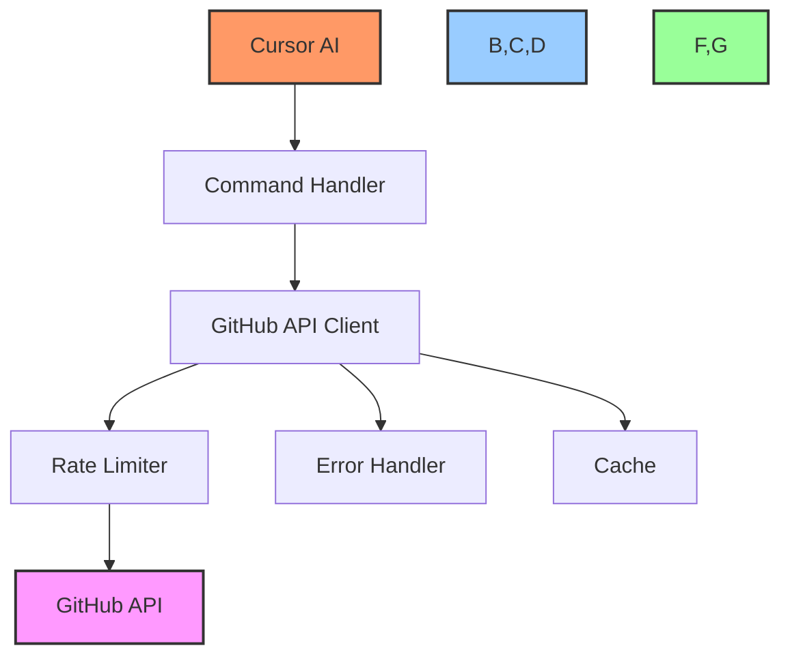
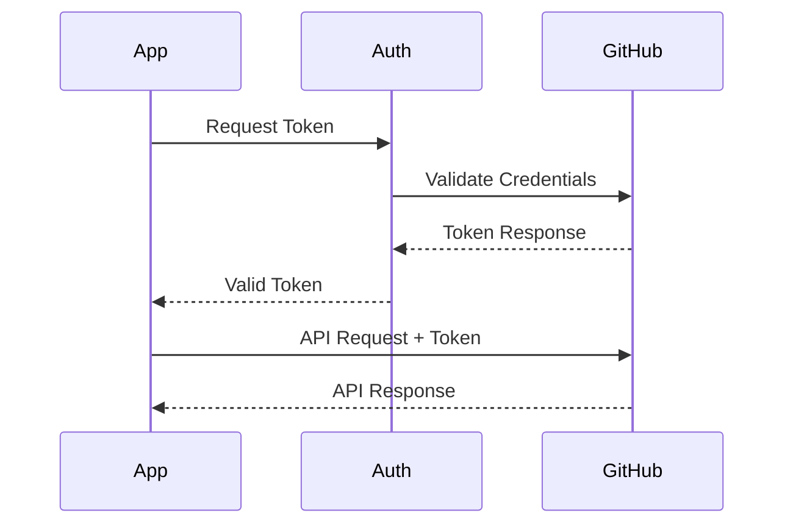
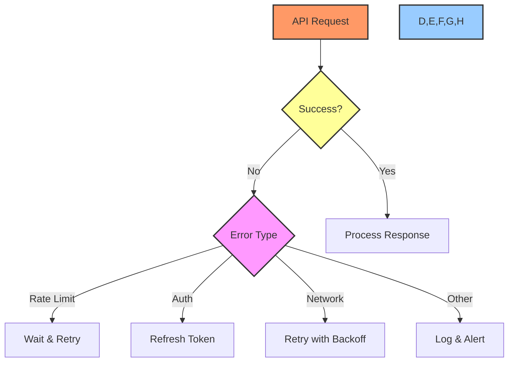

# 🌐 API Integration Guide

## 📋 Table of Contents
- [Overview](#overview)
- [GitHub API Integration](#github-api-integration)
- [MCP Server Integration](#mcp-server-integration)
- [Authentication](#authentication)
- [Rate Limiting](#rate-limiting)
- [Error Handling](#error-handling)
- [Best Practices](#best-practices)
- [Examples](#examples)

## 🔍 Overview

This technical guide details the API integration between Cursor AI, GitHub's API, and the GitHub MCP Server. It covers authentication, rate limiting, error handling, and best practices for reliable API communication.

## 🔗 GitHub API Integration

### Architecture Overview


### API Client Implementation
```typescript
class GitHubAPIClient {
    private token: string;
    private baseUrl: string;
    private rateLimiter: RateLimiter;

    constructor(token: string) {
        this.token = token;
        this.baseUrl = 'https://api.github.com';
        this.rateLimiter = new RateLimiter({
            maxRequests: 5000,
            perHour: true
        });
    }

    async request(endpoint: string, options: RequestOptions): Promise<Response> {
        await this.rateLimiter.checkLimit();
        return this.sendRequest(endpoint, options);
    }
}
```

## 🤖 MCP Server Integration

### MCP Connection Setup
```typescript
interface MCPConfig {
    serverUrl: string;
    authToken: string;
    features: string[];
}

class MCPConnection {
    private config: MCPConfig;
    
    async initialize(config: MCPConfig): Promise<void> {
        this.config = config;
        await this.validateConnection();
        await this.setupFeatures();
    }
}
```

### Available MCP Commands
| Category | Command | Description |
|----------|---------|-------------|
| Issues | `create_issue` | Create new issue |
| | `update_issue` | Update issue |
| | `get_issue` | Get issue details |
| PRs | `create_pr` | Create pull request |
| | `update_pr` | Update pull request |
| | `merge_pr` | Merge pull request |
| Projects | `create_project` | Create project |
| | `update_project` | Update project |

## 🔐 Authentication

### Token Management
```typescript
class TokenManager {
    private tokens: Map<string, string>;
    
    async rotateToken(scope: string): Promise<string> {
        const newToken = await this.generateToken(scope);
        this.tokens.set(scope, newToken);
        return newToken;
    }
    
    async validateToken(token: string): Promise<boolean> {
        try {
            const response = await this.testToken(token);
            return response.isValid;
        } catch (error) {
            return false;
        }
    }
}
```

### Authentication Flow


## ⚡ Rate Limiting

### Rate Limiter Implementation
```typescript
class RateLimiter {
    private limits: Map<string, number>;
    private usage: Map<string, number>;
    
    async checkLimit(endpoint: string): Promise<boolean> {
        const current = this.usage.get(endpoint) || 0;
        const limit = this.limits.get(endpoint) || 5000;
        
        if (current >= limit) {
            throw new RateLimitError(endpoint);
        }
        
        this.usage.set(endpoint, current + 1);
        return true;
    }
    
    async resetLimits(): Promise<void> {
        this.usage.clear();
    }
}
```

### Rate Limit Monitoring
```typescript
interface RateLimit {
    limit: number;
    remaining: number;
    reset: number;
}

async function monitorRateLimits(): Promise<RateLimit> {
    const response = await github.rateLimit.get();
    return {
        limit: response.data.resources.core.limit,
        remaining: response.data.resources.core.remaining,
        reset: response.data.resources.core.reset
    };
}
```

## ❌ Error Handling

### Error Types
```typescript
class GitHubAPIError extends Error {
    constructor(
        public status: number,
        public code: string,
        message: string
    ) {
        super(message);
    }
}

class RateLimitError extends GitHubAPIError {
    constructor(endpoint: string) {
        super(429, 'RATE_LIMIT_EXCEEDED', 
            `Rate limit exceeded for ${endpoint}`);
    }
}
```

### Error Handling Flow


## ✅ Best Practices

### API Usage
1. Always use rate limiting
2. Implement proper error handling
3. Cache responses when possible
4. Use conditional requests

### Authentication
1. Rotate tokens regularly
2. Use minimal required scopes
3. Validate tokens before use
4. Handle token expiration

### Error Handling
1. Implement retries with backoff
2. Log detailed error information
3. Monitor error rates
4. Alert on critical errors

## 💡 Examples

### Creating an Issue
```typescript
async function createIssue(
    repo: string,
    title: string,
    body: string
): Promise<Issue> {
    try {
        await rateLimiter.checkLimit('issues');
        
        const response = await github.issues.create({
            owner: 'PowerBridge-ai',
            repo,
            title,
            body
        });
        
        return response.data;
    } catch (error) {
        await errorHandler.handle(error);
        throw error;
    }
}
```

### Updating a Pull Request
```typescript
async function updatePR(
    repo: string,
    prNumber: number,
    data: UpdatePRData
): Promise<PullRequest> {
    try {
        await rateLimiter.checkLimit('pulls');
        
        const response = await github.pulls.update({
            owner: 'PowerBridge-ai',
            repo,
            pull_number: prNumber,
            ...data
        });
        
        return response.data;
    } catch (error) {
        await errorHandler.handle(error);
        throw error;
    }
}
```

## 🔗 Related Documentation
- [GitHub Project Automation](../github-project-automation.md)
- [Voice Processing Guide](voice-processing.md)
- [Chat Processing Guide](chat-processing.md)

---

Made with Power, Love, and AI •  ⚡️❤️�� •  POWERBRIDGE.AI