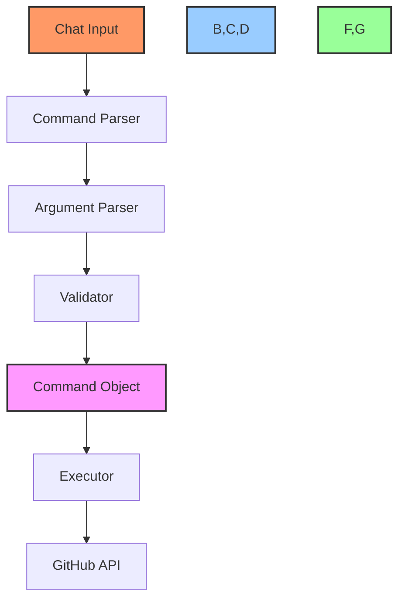
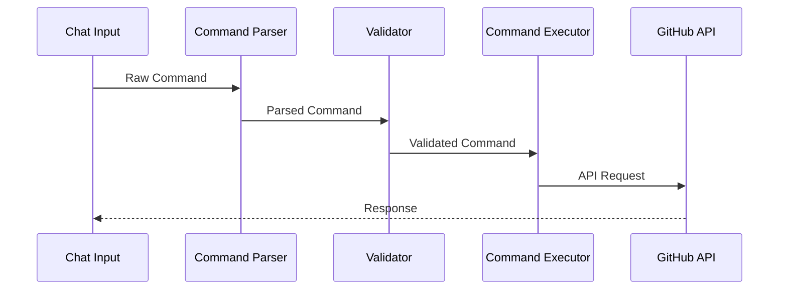
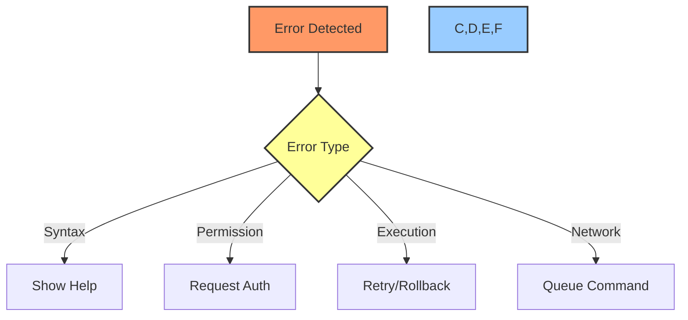

# 💬 Chat Processing Guide

## 📋 Table of Contents
- [Overview](#overview)
- [Command Processing System](#command-processing-system)
- [Parser Implementation](#parser-implementation)
- [Command Execution](#command-execution)
- [Error Handling](#error-handling)
- [Performance Optimization](#performance-optimization)
- [Integration Points](#integration-points)
- [Examples](#examples)

## 🔍 Overview

This technical guide details the chat command processing system used in the Cursor AI x GitHub Project Automation Toolkit. It covers command parsing, execution, error handling, and integration with GitHub actions.

## ⚙️ Command Processing System

### System Architecture


### Command Structure
```typescript
interface ChatCommand {
    name: string;
    subcommand?: string;
    args: Map<string, any>;
    flags: Set<string>;
    options: Map<string, string>;
    raw: string;
}

class CommandDefinition {
    name: string;
    aliases: string[];
    subcommands: Map<string, SubcommandDefinition>;
    options: CommandOption[];
    handler: (cmd: ChatCommand) => Promise<void>;
}
```

## 🔍 Parser Implementation

### Command Parser
```typescript
class CommandParser {
    private commands: Map<string, CommandDefinition>;
    private tokenizer: Tokenizer;
    
    async parse(input: string): Promise<ChatCommand> {
        const tokens = this.tokenizer.tokenize(input);
        const command = this.parseCommand(tokens);
        await this.validateCommand(command);
        return command;
    }
    
    private parseCommand(tokens: Token[]): ChatCommand {
        const name = tokens[0].value;
        const definition = this.commands.get(name);
        
        if (!definition) {
            throw new UnknownCommandError(name);
        }
        
        return this.buildCommand(definition, tokens.slice(1));
    }
}
```

### Argument Parser
```typescript
class ArgumentParser {
    private static readonly FLAG_REGEX = /^--?[\w-]+$/;
    
    parse(tokens: Token[]): ParsedArgs {
        const args = new Map<string, any>();
        const flags = new Set<string>();
        const options = new Map<string, string>();
        
        for (let i = 0; i < tokens.length; i++) {
            const token = tokens[i];
            
            if (this.isFlag(token.value)) {
                this.parseFlag(token, flags, options, tokens[i + 1]);
                i += this.hasValue(token.value) ? 1 : 0;
            } else {
                args.set(String(args.size), token.value);
            }
        }
        
        return { args, flags, options };
    }
}
```

## 🎯 Command Execution

### Execution Pipeline


### Command Executor
```typescript
class CommandExecutor {
    private handlers: Map<string, CommandHandler>;
    private github: GitHubClient;
    
    async execute(command: ChatCommand): Promise<void> {
        const handler = this.getHandler(command);
        await this.preExecute(command);
        
        try {
            await handler.execute(command);
        } finally {
            await this.postExecute(command);
        }
    }
    
    private async preExecute(command: ChatCommand): Promise<void> {
        await this.validatePermissions(command);
        await this.prepareContext(command);
    }
}
```

## ❌ Error Handling

### Error Types
```typescript
class ChatCommandError extends Error {
    constructor(
        public code: string,
        public command: string,
        message: string
    ) {
        super(message);
    }
}

class CommandSyntaxError extends ChatCommandError {
    constructor(command: string, details: string) {
        super('SYNTAX_ERROR', command,
            `Invalid syntax in command "${command}": ${details}`);
    }
}
```

### Error Recovery Flow


## ⚡ Performance Optimization

### Command Caching
```typescript
class CommandCache {
    private cache: LRUCache<string, ParsedCommand>;
    
    constructor(options: CacheOptions) {
        this.cache = new LRUCache({
            max: options.maxSize || 1000,
            maxAge: options.maxAge || 1000 * 60 * 5
        });
    }
    
    async get(key: string): Promise<ParsedCommand | null> {
        return this.cache.get(key);
    }
}
```

### Performance Monitoring
```typescript
interface CommandMetrics {
    parseTime: number;
    validationTime: number;
    executionTime: number;
    totalTime: number;
}

class MetricsCollector {
    private metrics: CommandMetrics[];
    
    track(command: string, metrics: CommandMetrics): void {
        this.metrics.push({
            command,
            timestamp: Date.now(),
            ...metrics
        });
    }
}
```

## 🔌 Integration Points

### GitHub Integration
```typescript
class GitHubCommandIntegration {
    private parser: CommandParser;
    private executor: CommandExecutor;
    private github: GitHubClient;
    
    async processCommand(input: string): Promise<void> {
        const command = await this.parser.parse(input);
        await this.executor.execute(command);
    }
}
```

### Event System
```typescript
interface CommandEvent {
    type: CommandEventType;
    command: ChatCommand;
    timestamp: number;
    metadata: Record<string, any>;
}

class CommandEventEmitter {
    private listeners: Map<string, Function[]>;
    
    emit(event: CommandEvent): void {
        const listeners = this.listeners.get(event.type) || [];
        listeners.forEach(listener => listener(event));
    }
}
```

## 💡 Examples

### Basic Command Processing
```typescript
// Process "/task create --title 'Fix login bug' --labels bug,urgent"
async function processTaskCommand(input: string): Promise<void> {
    const parser = new CommandParser();
    const executor = new CommandExecutor();
    
    try {
        const command = await parser.parse(input);
        await executor.execute(command);
    } catch (error) {
        await errorHandler.handle(error);
    }
}
```

### Complex Command Chain
```typescript
// Process "/project create 'Auth System' && /task add 'Implement JWT'"
async function processCommandChain(input: string): Promise<void> {
    const pipeline = new CommandPipeline();
    
    try {
        const result = await pipeline
            .parseCommands(input)
            .validateAll()
            .executeSequentially();
            
        await notifySuccess(result);
    } catch (error) {
        await handleChainError(error);
    }
}
```

## 🔗 Related Documentation
- [Voice Processing Guide](voice-processing.md)
- [API Integration Guide](api-integration.md)
- [Chat Command Guide](../chat-prompts.md)

---

Made with Power, Love, and AI •  ⚡️❤️�� •  POWERBRIDGE.AI