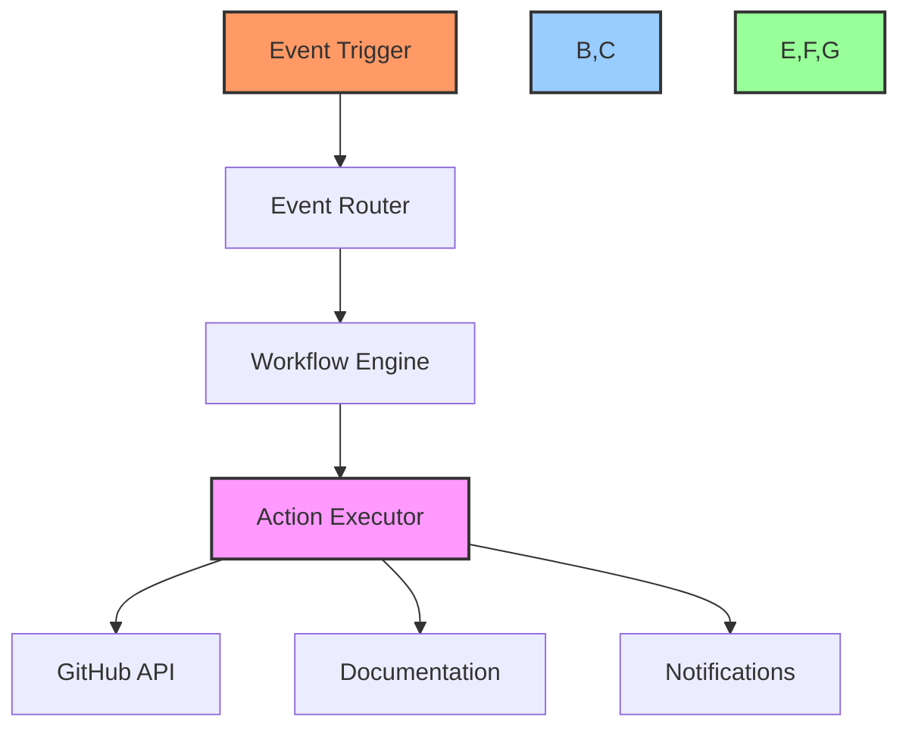
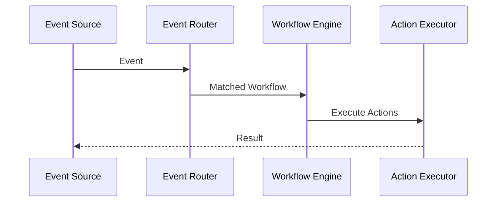
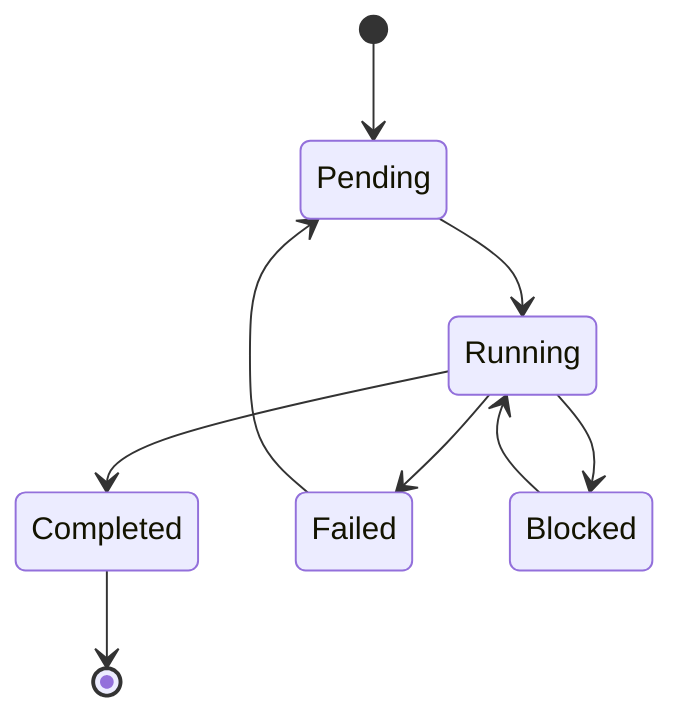

# 🤖 Project Automation Guide

## 📋 Table of Contents
- [Overview](#overview)
- [Automation System](#automation-system)
- [Workflow Implementation](#workflow-implementation)
- [Event Handling](#event-handling)
- [State Management](#state-management)
- [Integration Points](#integration-points)
- [Performance Optimization](#performance-optimization)
- [Examples](#examples)

## 🔍 Overview

This technical guide details the project automation system used in the Cursor AI x GitHub Project Automation Toolkit. It covers workflow automation, event handling, state management, and integration with GitHub Actions.

## ⚙️ Automation System

### System Architecture


### Automation Components
```typescript
interface AutomationConfig {
    workflows: WorkflowDefinition[];
    triggers: TriggerDefinition[];
    actions: ActionDefinition[];
    conditions: ConditionDefinition[];
}

class AutomationEngine {
    private config: AutomationConfig;
    private workflowEngine: WorkflowEngine;
    private eventRouter: EventRouter;
    
    async initialize(config: AutomationConfig): Promise<void> {
        this.config = config;
        await this.setupComponents();
        await this.validateConfig();
    }
}
```

## 🔄 Workflow Implementation

### Workflow Definition
```typescript
interface WorkflowDefinition {
    name: string;
    description: string;
    triggers: TriggerConfig[];
    conditions: ConditionConfig[];
    actions: ActionConfig[];
    errorHandling: ErrorConfig;
}

class WorkflowEngine {
    private workflows: Map<string, Workflow>;
    
    async executeWorkflow(name: string, context: Context): Promise<void> {
        const workflow = this.workflows.get(name);
        if (!workflow) {
            throw new WorkflowNotFoundError(name);
        }
        
        await workflow.execute(context);
    }
}
```

### Action Implementation
```typescript
interface ActionDefinition {
    type: string;
    config: Record<string, any>;
    handler: (context: Context) => Promise<void>;
}

class ActionExecutor {
    private actions: Map<string, ActionHandler>;
    
    async execute(action: ActionDefinition, context: Context): Promise<void> {
        const handler = this.actions.get(action.type);
        if (!handler) {
            throw new ActionNotFoundError(action.type);
        }
        
        await handler.execute(action.config, context);
    }
}
```

## 📡 Event Handling

### Event System


### Event Router Implementation
```typescript
class EventRouter {
    private routes: Map<string, WorkflowDefinition[]>;
    
    async routeEvent(event: Event): Promise<void> {
        const workflows = this.findMatchingWorkflows(event);
        await Promise.all(
            workflows.map(workflow => 
                this.executeWorkflow(workflow, event)
            )
        );
    }
    
    private findMatchingWorkflows(event: Event): WorkflowDefinition[] {
        return Array.from(this.routes.entries())
            .filter(([pattern]) => this.matchesPattern(event, pattern))
            .flatMap(([, workflows]) => workflows);
    }
}
```

## 📊 State Management

### State Store
```typescript
interface StateStore {
    get(key: string): Promise<any>;
    set(key: string, value: any): Promise<void>;
    delete(key: string): Promise<void>;
    clear(): Promise<void>;
}

class WorkflowStateManager {
    private store: StateStore;
    
    async saveState(workflowId: string, state: any): Promise<void> {
        await this.store.set(`workflow:${workflowId}`, state);
    }
    
    async getState(workflowId: string): Promise<any> {
        return this.store.get(`workflow:${workflowId}`);
    }
}
```

### State Transitions


## 🔌 Integration Points

### GitHub Actions Integration
```typescript
class GitHubActionsIntegration {
    private workflowEngine: WorkflowEngine;
    private github: GitHubClient;
    
    async handleGitHubEvent(event: GitHubEvent): Promise<void> {
        const context = await this.createContext(event);
        await this.workflowEngine.executeWorkflow(
            this.determineWorkflow(event),
            context
        );
    }
}
```

### Documentation Integration
```typescript
class DocumentationIntegrator {
    private docEngine: DocumentationEngine;
    
    async updateDocs(changes: WorkflowChanges): Promise<void> {
        await this.docEngine.updateTaskStatus(changes);
        await this.docEngine.generateReport(changes);
        await this.docEngine.syncChanges();
    }
}
```

## ⚡ Performance Optimization

### Caching System
```typescript
class WorkflowCache {
    private cache: LRUCache<string, WorkflowResult>;
    
    constructor(options: CacheOptions) {
        this.cache = new LRUCache({
            max: options.maxSize || 1000,
            maxAge: options.maxAge || 1000 * 60 * 30
        });
    }
    
    async getCachedResult(key: string): Promise<WorkflowResult | null> {
        return this.cache.get(key);
    }
}
```

### Performance Monitoring
```typescript
interface WorkflowMetrics {
    executionTime: number;
    actionCount: number;
    successRate: number;
    resourceUsage: ResourceMetrics;
}

class MetricsCollector {
    private metrics: WorkflowMetrics[];
    
    track(workflow: string, metrics: WorkflowMetrics): void {
        this.metrics.push({
            workflow,
            timestamp: Date.now(),
            ...metrics
        });
    }
}
```

## 💡 Examples

### Basic Workflow
```typescript
// Define a workflow that creates issues for new branches
const branchWorkflow: WorkflowDefinition = {
    name: 'branch-issue-creator',
    triggers: [{
        event: 'create',
        conditions: [
            { type: 'ref_type', value: 'branch' }
        ]
    }],
    actions: [{
        type: 'create_issue',
        config: {
            title: 'New Branch: ${event.ref}',
            body: 'Branch created by ${event.sender.login}'
        }
    }]
};
```

### Complex Automation
```typescript
// Implement a PR review workflow
const reviewWorkflow: WorkflowDefinition = {
    name: 'pr-review-automation',
    triggers: [{
        event: 'pull_request',
        conditions: [
            { type: 'action', value: 'opened' }
        ]
    }],
    actions: [
        {
            type: 'assign_reviewers',
            config: {
                count: 2,
                team: 'developers'
            }
        },
        {
            type: 'add_labels',
            config: {
                labels: ['needs-review']
            }
        },
        {
            type: 'update_project',
            config: {
                column: 'Review'
            }
        }
    ]
};
```

## 🔗 Related Documentation
- [API Integration Guide](api-integration.md)
- [GitHub Project Automation](../github-project-automation.md)
- [Workflow Guide](../workflow-guide.md)

---

Made with Power, Love, and AI •  ⚡️❤️�� •  POWERBRIDGE.AI