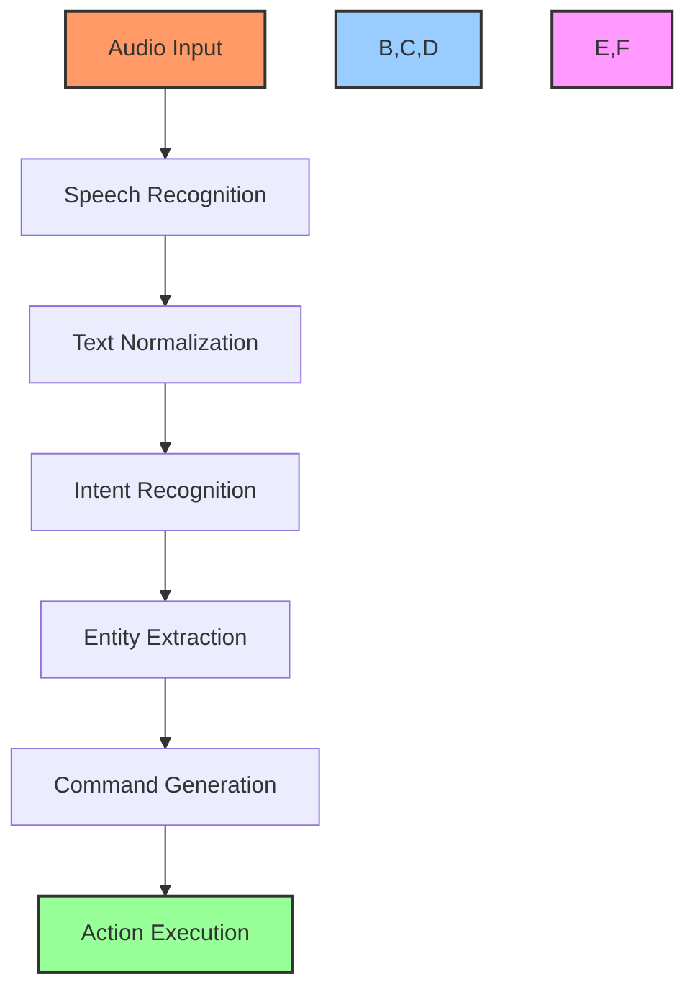
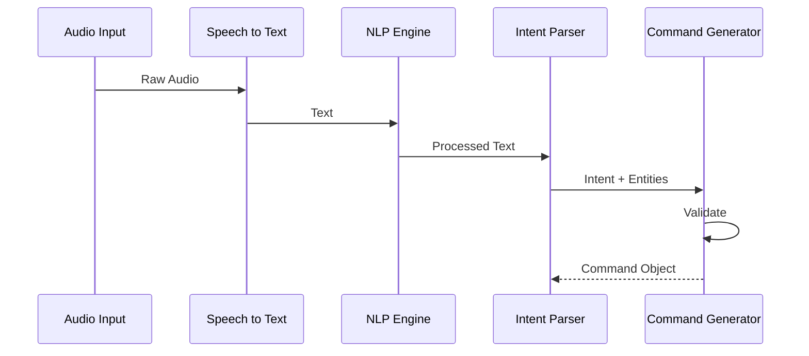
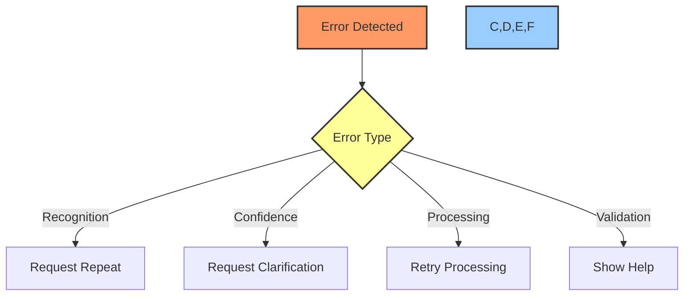

# 🎤 Voice Processing Guide

## 📋 Table of Contents
- [Overview](#overview)
- [Voice Recognition System](#voice-recognition-system)
- [Natural Language Processing](#natural-language-processing)
- [Command Processing](#command-processing)
- [Error Handling](#error-handling)
- [Performance Optimization](#performance-optimization)
- [Integration Points](#integration-points)
- [Examples](#examples)

## 🔍 Overview

This technical guide details the voice processing system used in the Cursor AI x GitHub Project Automation Toolkit. It covers speech recognition, natural language processing, command parsing, and integration with GitHub actions.

## 🗣️ Voice Recognition System

### System Architecture


### Speech Recognition Implementation
```typescript
class SpeechRecognizer {
    private engine: SpeechEngine;
    private language: string;
    private confidence: number;

    constructor(config: SpeechConfig) {
        this.engine = new SpeechEngine(config);
        this.language = config.language || 'en-US';
        this.confidence = config.minConfidence || 0.8;
    }

    async recognize(audio: AudioStream): Promise<RecognitionResult> {
        const result = await this.engine.process(audio);
        return this.validateResult(result);
    }

    private validateResult(result: RecognitionResult): RecognitionResult {
        if (result.confidence < this.confidence) {
            throw new LowConfidenceError(result);
        }
        return result;
    }
}
```

## 🧠 Natural Language Processing

### NLP Pipeline


### Intent Recognition
```typescript
interface Intent {
    action: string;
    confidence: number;
    entities: Entity[];
    metadata: Record<string, any>;
}

class IntentRecognizer {
    private models: Map<string, IntentModel>;
    
    async recognize(text: string): Promise<Intent> {
        const tokens = await this.tokenize(text);
        const intent = await this.classifyIntent(tokens);
        const entities = await this.extractEntities(tokens, intent);
        
        return {
            action: intent.action,
            confidence: intent.confidence,
            entities,
            metadata: intent.metadata
        };
    }
}
```

## 🎯 Command Processing

### Command Structure
```typescript
interface VoiceCommand {
    type: CommandType;
    action: string;
    parameters: Map<string, any>;
    context: CommandContext;
    metadata: CommandMetadata;
}

class CommandProcessor {
    async processIntent(intent: Intent): Promise<VoiceCommand> {
        const command = this.createCommand(intent);
        await this.validateCommand(command);
        await this.enrichCommand(command);
        return command;
    }
}
```

### Command Validation
```typescript
class CommandValidator {
    private rules: ValidationRule[];
    
    async validate(command: VoiceCommand): Promise<ValidationResult> {
        const results = await Promise.all(
            this.rules.map(rule => rule.validate(command))
        );
        
        return this.aggregateResults(results);
    }
}
```

## ❌ Error Handling

### Error Types
```typescript
class VoiceProcessingError extends Error {
    constructor(
        public code: string,
        public details: any,
        message: string
    ) {
        super(message);
    }
}

class RecognitionError extends VoiceProcessingError {
    constructor(details: any) {
        super('RECOGNITION_FAILED', details,
            'Failed to recognize speech input');
    }
}
```

### Error Recovery Flow


## ⚡ Performance Optimization

### Caching System
```typescript
class RecognitionCache {
    private cache: LRUCache<string, RecognitionResult>;
    
    constructor(options: CacheOptions) {
        this.cache = new LRUCache({
            max: options.maxSize || 1000,
            maxAge: options.maxAge || 1000 * 60 * 60
        });
    }
    
    async get(key: string): Promise<RecognitionResult | null> {
        return this.cache.get(key);
    }
}
```

### Performance Metrics
```typescript
interface PerformanceMetrics {
    recognitionTime: number;
    processingTime: number;
    commandGenerationTime: number;
    totalLatency: number;
}

class PerformanceMonitor {
    private metrics: PerformanceMetrics[];
    
    track(operation: string, duration: number): void {
        this.metrics.push({
            operation,
            duration,
            timestamp: Date.now()
        });
    }
}
```

## 🔌 Integration Points

### GitHub Integration
```typescript
class GitHubVoiceIntegration {
    private processor: CommandProcessor;
    private github: GitHubClient;
    
    async processVoiceCommand(audio: AudioStream): Promise<void> {
        const text = await this.recognizeSpeech(audio);
        const intent = await this.processor.recognizeIntent(text);
        const command = await this.processor.createCommand(intent);
        await this.github.executeCommand(command);
    }
}
```

### Event System
```typescript
interface VoiceEvent {
    type: VoiceEventType;
    data: any;
    timestamp: number;
}

class VoiceEventEmitter {
    private listeners: Map<string, Function[]>;
    
    emit(event: VoiceEvent): void {
        const listeners = this.listeners.get(event.type) || [];
        listeners.forEach(listener => listener(event));
    }
}
```

## 💡 Examples

### Basic Voice Command
```typescript
// Process "create issue fix login bug"
async function processCreateIssueCommand(audio: AudioStream): Promise<void> {
    const recognizer = new SpeechRecognizer();
    const processor = new CommandProcessor();
    
    try {
        const text = await recognizer.recognize(audio);
        const intent = await processor.recognizeIntent(text);
        const command = await processor.createCommand(intent);
        
        await github.issues.create({
            owner: 'PowerBridge-ai',
            repo: 'my-project',
            title: command.parameters.get('title'),
            body: command.parameters.get('body')
        });
    } catch (error) {
        await errorHandler.handle(error);
    }
}
```

### Complex Command Processing
```typescript
// Process "assign high priority task implement authentication to @developer"
async function processComplexCommand(audio: AudioStream): Promise<void> {
    const pipeline = new VoiceProcessingPipeline();
    
    try {
        const result = await pipeline
            .recognize(audio)
            .extractIntent()
            .parseEntities()
            .validateCommand()
            .execute();
            
        await notifySuccess(result);
    } catch (error) {
        await handleProcessingError(error);
    }
}
```

## 🔗 Related Documentation
- [Chat Processing Guide](chat-processing.md)
- [API Integration Guide](api-integration.md)
- [Voice Command Guide](../voice-commands.md)

---

Made with Power, Love, and AI •  ⚡️❤️�� •  POWERBRIDGE.AI