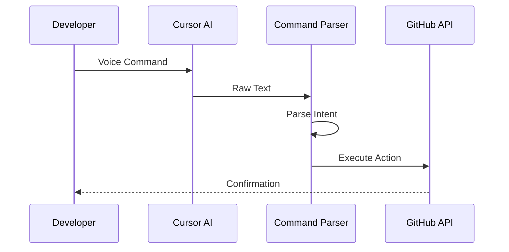
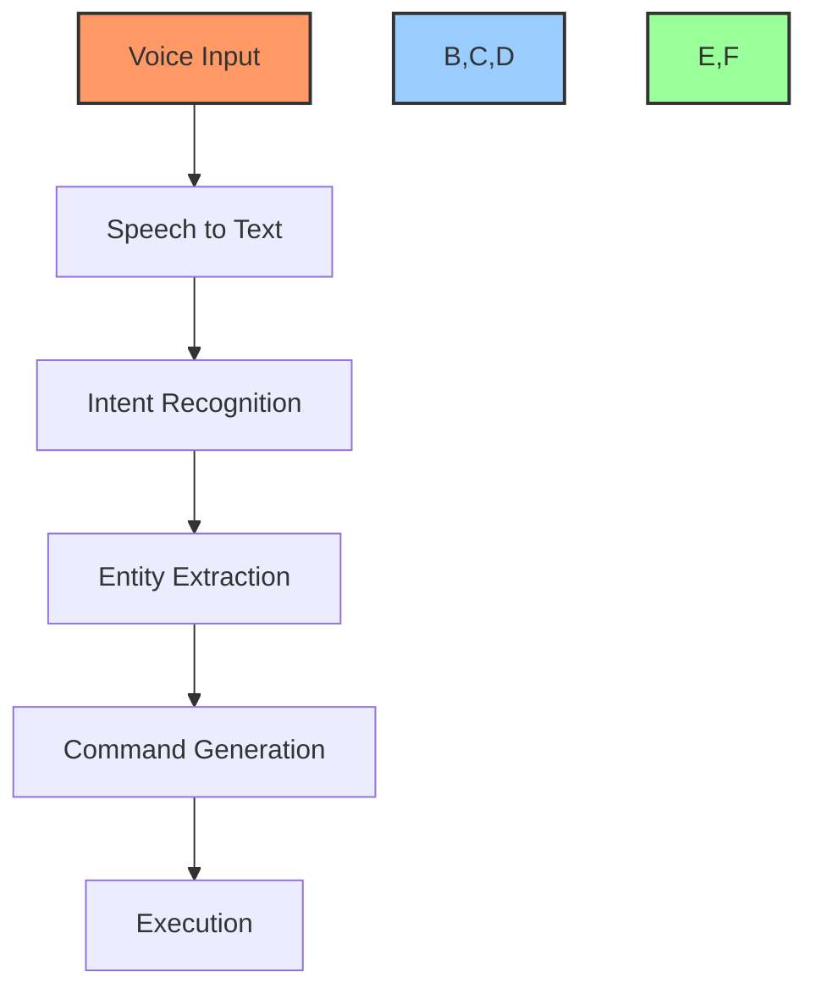
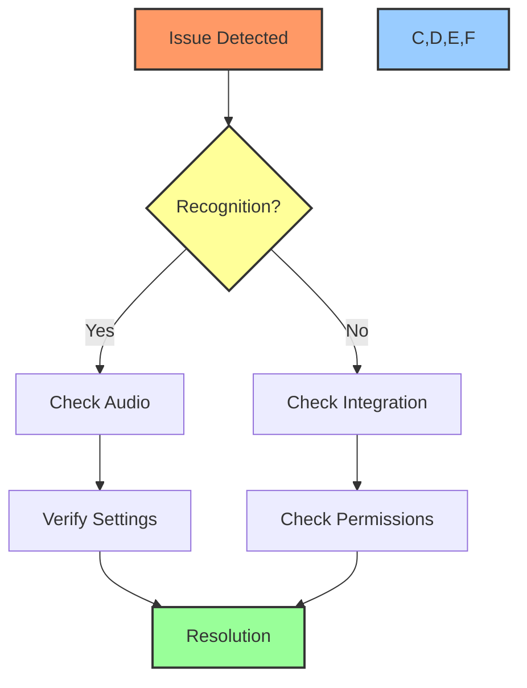

# 🎤 Voice Commands Guide

## 📋 Table of Contents
- [Overview](#overview)
- [Voice Command Structure](#voice-command-structure)
- [Available Commands](#available-commands)
- [Command Examples](#command-examples)
- [Natural Language Processing](#natural-language-processing)
- [Command Customization](#command-customization)
- [Troubleshooting](#troubleshooting)
- [Best Practices](#best-practices)

## 🔍 Overview

This guide explains how to use voice commands with the Cursor AI x GitHub Project Automation Toolkit. Voice commands provide a natural and efficient way to manage projects, create tasks, and update status without leaving your development environment.

## 🎯 Voice Command Structure

### Basic Command Pattern
```typescript
interface VoiceCommand {
    action: string;    // What to do
    target: string;    // What to act on
    params: object;    // Additional details
}
```

### Command Flow


## 📝 Available Commands

### Task Management
| Command Type | Example | Description |
|-------------|---------|-------------|
| Create | "Create task implement login" | Creates new task/issue |
| Update | "Update task AUTH-001" | Updates existing task |
| Delete | "Delete task AUTH-001" | Removes task |
| Assign | "Assign AUTH-001 to @dev" | Assigns task to user |

### Status Updates
| Command Type | Example | Description |
|-------------|---------|-------------|
| Start | "Start task AUTH-001" | Moves to In Progress |
| Block | "Block task AUTH-001" | Marks as blocked |
| Complete | "Complete task AUTH-001" | Marks as done |
| Review | "Review task AUTH-001" | Moves to review |

### Project Management
| Command Type | Example | Description |
|-------------|---------|-------------|
| Sprint | "Add to sprint 1" | Adds to sprint |
| Priority | "Set priority high" | Sets priority |
| Label | "Add label bug" | Adds label |
| Milestone | "Set milestone v1" | Sets milestone |

## 💡 Command Examples

### Task Creation
```bash
# Basic task creation
"Create task implement user authentication"

# Detailed task creation
"Create high priority task implement JWT authentication with acceptance criteria must support refresh tokens and assign to @security-team"

# Quick task
"Quick task fix login bug"
```

### Status Updates
```bash
# Start task
"Start working on AUTH-001"

# Block task
"Block AUTH-001 waiting for API"

# Complete task
"Mark AUTH-001 as complete"
```

### Project Organization
```bash
# Sprint management
"Add AUTH-001 to current sprint"

# Priority setting
"Set AUTH-001 priority to high"

# Labeling
"Add security label to AUTH-001"
```

## 🧠 Natural Language Processing

### Command Recognition


### Intent Mapping
| Phrase | Intent | Action |
|--------|--------|--------|
| "create" | CREATE | Create new item |
| "update" | UPDATE | Modify existing |
| "start" | START | Begin task |
| "finish" | COMPLETE | Complete task |

## ⚙️ Command Customization

### Custom Command Template
```typescript
interface CustomVoiceCommand {
    trigger: string[];     // Trigger phrases
    action: Function;      // Action to execute
    parameters: string[];  // Expected parameters
    examples: string[];    // Usage examples
}
```

### Adding Custom Commands
```typescript
const customCommand = {
    trigger: ["deploy", "release"],
    action: async (params) => {
        // Implementation
    },
    parameters: ["version", "environment"],
    examples: [
        "deploy version 1.0 to staging",
        "release v2.0 to production"
    ]
};
```

## ❗ Troubleshooting

### Common Issues

1. **Recognition Problems**:
   - Speak clearly and at normal pace
   - Use standard command structure
   - Check microphone settings
   - Verify Cursor AI is active

2. **Command Execution Issues**:
   - Verify GitHub connection
   - Check permissions
   - Review command syntax
   - Check task/issue exists

3. **Integration Issues**:
   - Verify GitHub CLI setup
   - Check API tokens
   - Review workflow configuration

### Debug Process


## ✅ Best Practices

### Command Structure
1. Use clear, consistent phrases
2. Include all necessary information
3. Follow standard patterns
4. Verify command recognition

### Workflow Integration
1. Use voice for quick actions
2. Combine with chat commands
3. Verify important actions
4. Keep commands simple

### Error Prevention
1. Use standard terminology
2. Speak at normal pace
3. Review before execution
4. Monitor command status

## 🔗 Related Documentation
- [Chat Command Guide](chat-prompts.md)
- [Project Creation Guide](project-creation-guide.md)
- [GitHub Project Automation](github-project-automation.md)

---

Made with Power, Love, and AI •  ⚡️❤️�� •  POWERBRIDGE.AI