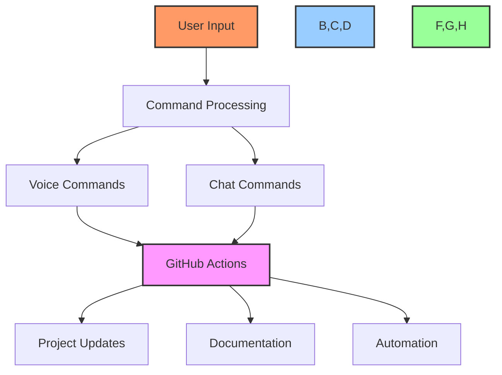
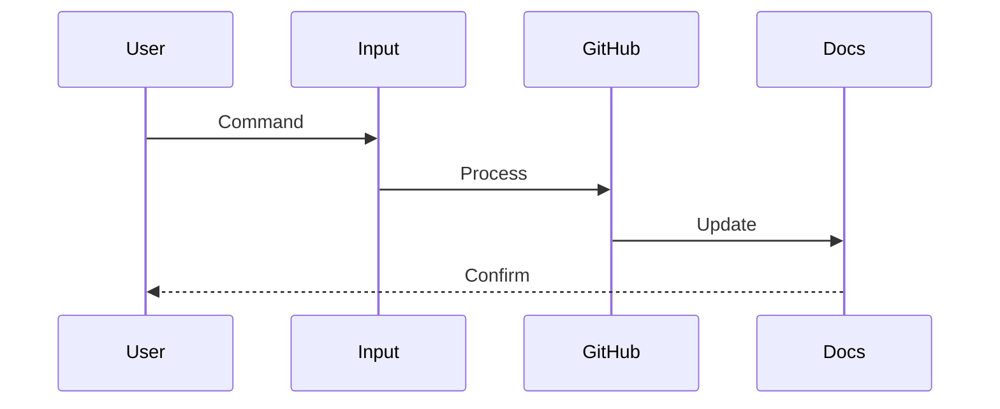
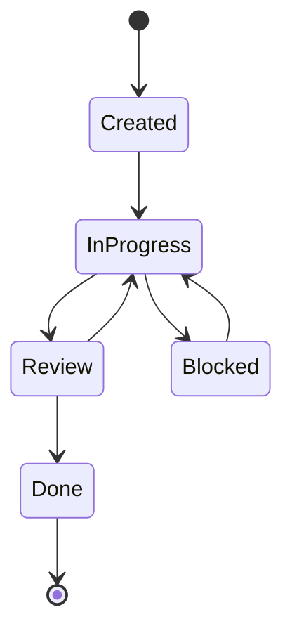
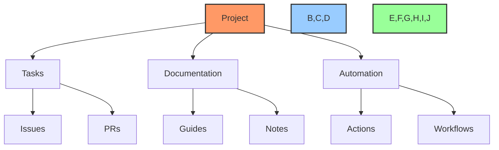
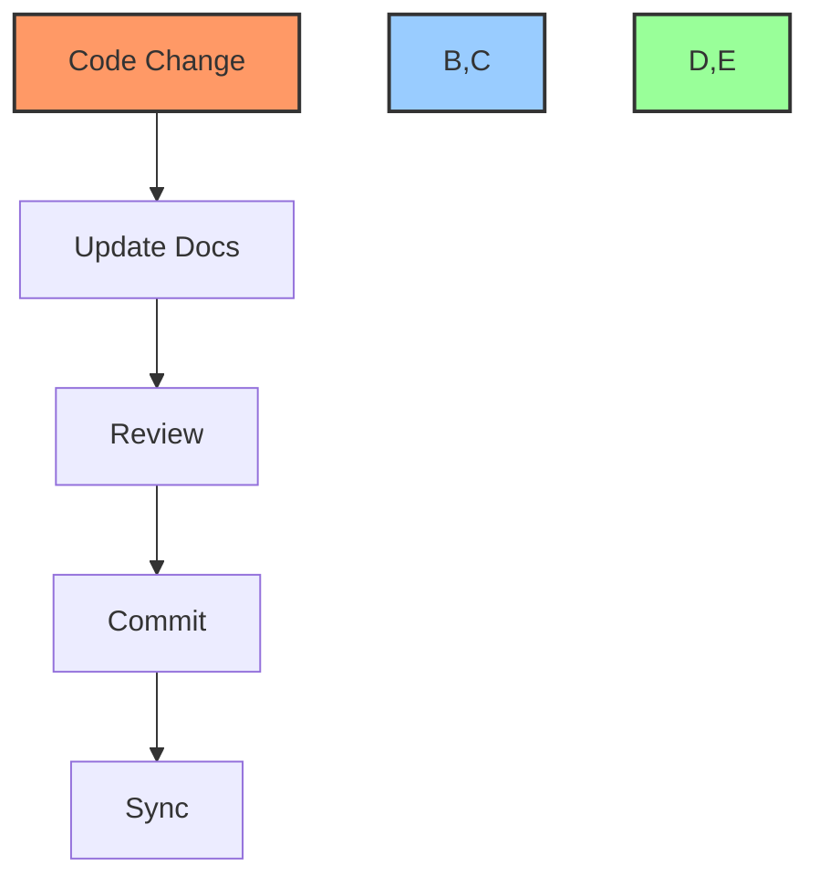
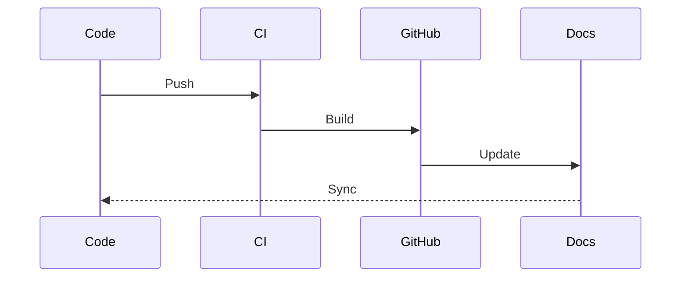
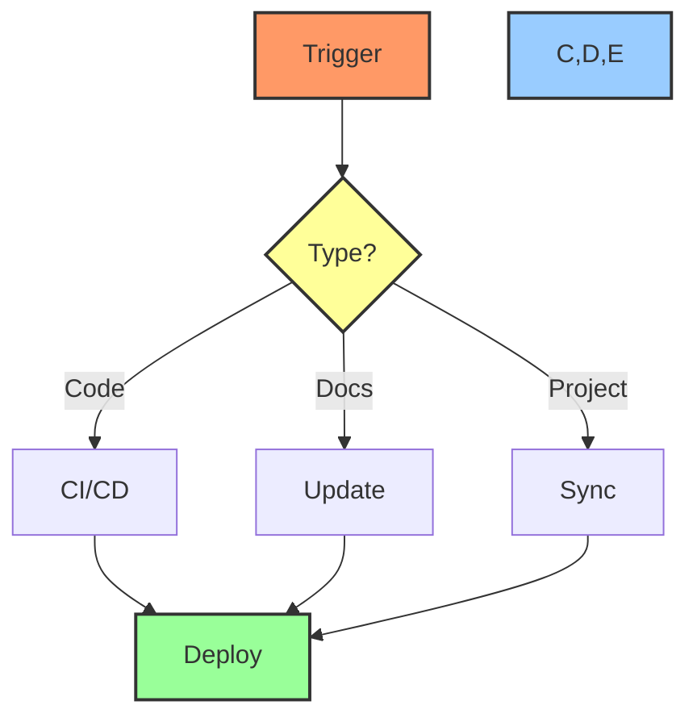

# 🔄 Workflow Guide

## 📋 Table of Contents
- [Overview](#overview)
- [Core Workflows](#core-workflows)
- [Task Management](#task-management)
- [Project Management](#project-management)
- [Documentation](#documentation)
- [Integration](#integration)
- [Automation](#automation)
- [Best Practices](#best-practices)

## 🔍 Overview

This guide outlines the standard workflows for using the Cursor AI x GitHub Project Automation Toolkit. It covers task management, project organization, documentation processes, and automation workflows.

## 🎯 Core Workflows

### System Overview


### Workflow Integration


## 📝 Task Management

### Task Lifecycle


### Task Creation Process
1. **Initialize Task**
   ```bash
   # Voice command
   "Create task implement authentication"
   
   # Chat command
   /task create --title "Implement Authentication"
   ```

2. **Add Details**
   ```bash
   # Add description
   /task update AUTH-001 --body "Implement JWT authentication"
   
   # Add labels
   /task label AUTH-001 --add security,backend
   ```

3. **Assign & Schedule**
   ```bash
   # Assign task
   /task assign AUTH-001 --to @developer
   
   # Set deadline
   /task deadline AUTH-001 --date "2024-05-15"
   ```

## 📊 Project Management

### Project Structure


### Project Setup Process
1. **Create Project**
   ```bash
   /project create "Authentication System" --template kanban
   ```

2. **Configure Boards**
   ```bash
   /project board setup --columns "Todo,In Progress,Review,Done"
   ```

3. **Setup Automation**
   ```bash
   /project automation setup --template default
   ```

## 📚 Documentation

### Documentation Flow


### Documentation Process
1. **Update Documentation**
   ```bash
   # Generate docs
   /docs generate --scope authentication
   
   # Review changes
   /docs review --latest
   ```

2. **Sync Changes**
   ```bash
   # Sync with GitHub
   /docs sync --auto-commit
   ```

## 🔗 Integration

### Integration Flow


### Integration Steps
1. **Code Integration**
   ```bash
   # Review changes
   /review code --pr 123
   
   # Run checks
   /ci check --pr 123
   ```

2. **Documentation Integration**
   ```bash
   # Update docs
   /docs update --pr 123
   
   # Verify links
   /docs verify --scope all
   ```

## ⚡ Automation

### Automation Workflows


### Automation Setup
1. **Configure Actions**
   ```bash
   # Setup workflows
   /automation setup --template full
   
   # Configure triggers
   /automation triggers setup --default
   ```

2. **Test Automation**
   ```bash
   # Test workflow
   /automation test --workflow ci
   
   # Verify setup
   /automation verify --all
   ```

## ✅ Best Practices

### Task Management
1. Use clear, descriptive titles
2. Include all necessary details
3. Keep status updated
4. Cross-reference related items

### Project Organization
1. Maintain consistent structure
2. Use standard templates
3. Automate routine tasks
4. Keep documentation updated

### Documentation
1. Update in real-time
2. Use standard formats
3. Include examples
4. Cross-reference

### Automation
1. Test workflows
2. Monitor performance
3. Review logs
4. Update as needed

## 🔗 Related Documentation
- [Voice Command Guide](voice-commands.md)
- [Chat Command Guide](chat-prompts.md)
- [GitHub Project Automation](github-project-automation.md)

---

Made with Power, Love, and AI •  ⚡️❤️🤖 •  POWERBRIDGE.AI