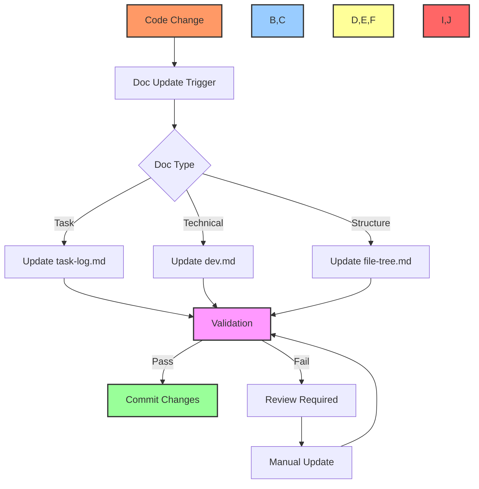
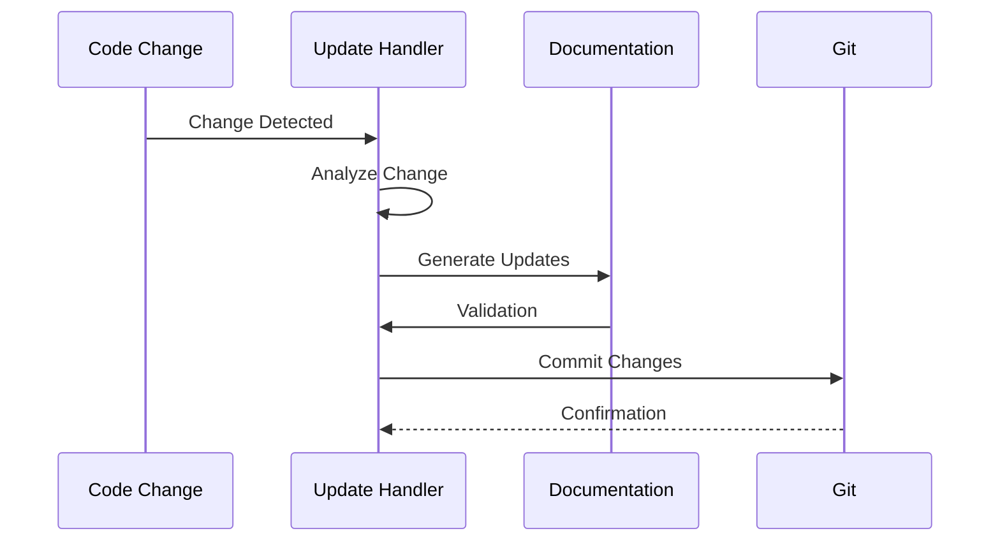

# 📚 Documentation Workflow Guide

## 📋 Table of Contents
- [Overview](#overview)
- [Documentation Lifecycle](#documentation-lifecycle)
- [Automation Components](#automation-components)
- [File Management](#file-management)
- [Integration Points](#integration-points)
- [Templates](#templates)
- [Examples](#examples)

## 🔍 Overview

This guide details the automated documentation workflow used in the Cursor AI x GitHub Project Automation Toolkit. It covers documentation creation, updates, synchronization, and maintenance across all project components.

## 🔄 Documentation Lifecycle

### Workflow Diagram


### Update Flow


## ⚙️ Automation Components

### Documentation Manager
```typescript
interface DocumentationConfig {
    basePath: string;
    templates: Map<string, string>;
    validators: Map<string, ValidatorFn>;
    handlers: Map<string, UpdateHandler>;
}

class DocumentationManager {
    private config: DocumentationConfig;
    
    async handleUpdate(change: CodeChange): Promise<void> {
        const docTypes = this.analyzeChange(change);
        await Promise.all(
            docTypes.map(type => this.updateDocumentation(type, change))
        );
    }
}
```

### Update Handlers
```typescript
interface UpdateHandler {
    canHandle(change: CodeChange): boolean;
    generateUpdate(change: CodeChange): Promise<DocumentUpdate>;
    validate(update: DocumentUpdate): Promise<boolean>;
    apply(update: DocumentUpdate): Promise<void>;
}

class TaskDocumentationHandler implements UpdateHandler {
    async generateUpdate(change: CodeChange): Promise<DocumentUpdate> {
        const taskInfo = await this.extractTaskInfo(change);
        return {
            file: 'task-log.md',
            content: this.formatTaskUpdate(taskInfo),
            metadata: this.generateMetadata(taskInfo)
        };
    }
}
```

## 📂 File Management

### Core Documentation Files
```typescript
const documentationFiles = {
    task: {
        path: 'task-log.md',
        template: 'task-template.md',
        required: true
    },
    technical: {
        path: 'dev.md',
        template: 'dev-template.md',
        required: true
    },
    structure: {
        path: 'file-tree.md',
        template: 'file-tree-template.md',
        required: true
    }
};
```

### File Synchronization
```typescript
class DocumentationSync {
    async syncFiles(): Promise<void> {
        // Get all documentation files
        const files = await this.getDocumentationFiles();
        
        // Validate structure
        await this.validateStructure(files);
        
        // Update cross-references
        await this.updateReferences(files);
        
        // Commit changes
        await this.commitChanges(files);
    }
}
```

## 🔌 Integration Points

### GitHub Integration
```typescript
class GitHubDocIntegration {
    async updatePRDescription(pr: PullRequest): Promise<void> {
        const docs = await this.getAffectedDocs(pr);
        const updates = await this.generateDocUpdates(docs);
        
        await this.createOrUpdateComment(pr, updates);
    }
    
    async validateDocumentation(pr: PullRequest): Promise<boolean> {
        const docs = await this.getAffectedDocs(pr);
        return this.runDocValidation(docs);
    }
}
```

### CI/CD Integration
```typescript
class DocumentationCI {
    async validateDocs(): Promise<ValidationResult> {
        // Check documentation structure
        await this.checkStructure();
        
        // Validate cross-references
        await this.validateReferences();
        
        // Check for broken links
        await this.checkLinks();
        
        // Verify templates
        await this.validateTemplates();
    }
}
```

## 📝 Templates

### Task Update Template
```markdown
## Task Update - [Date]

### Current Implementation
🎯 Task: [Task ID] - [Task Name]
📊 Progress: [Percentage]

#### Changes Made
- [Status] [Component]
- [Description of changes]

#### Technical Metrics
- [Metric]: [Value]
- [Metric]: [Value]

#### Next Steps
1. [Next task/action]
2. [Next task/action]
```

### Technical Documentation Template
```markdown
## Implementation Notes - [Date]

### [Component] Enhancement
✨ New Features:
- [Feature name]
  * [Implementation details]
  * [Technical decisions]
  * [Performance characteristics]

🔧 Configuration:
```json
{
    "setting": "value",
    "another_setting": "value"
}
```

📊 Performance Impact:
- Before: [Baseline metrics]
- After: [New metrics]
- Improvement: [Percentage]
```

## 💡 Examples

### Handling Code Changes
```typescript
const docHandler = new DocumentationHandler();

// Configure update triggers
docHandler.addTrigger('code_change', async (change) => {
    // Generate documentation updates
    const updates = await docHandler.generateUpdates(change);
    
    // Validate updates
    const isValid = await docHandler.validateUpdates(updates);
    
    if (isValid) {
        // Apply updates
        await docHandler.applyUpdates(updates);
    } else {
        // Request manual review
        await docHandler.requestReview(updates);
    }
});
```

### Automated PR Documentation
```typescript
const prHandler = new PRDocumentationHandler();

// Handle PR creation
prHandler.addHandler('pull_request.created', async (pr) => {
    // Generate documentation updates
    const docs = await prHandler.analyzeChanges(pr);
    
    // Update PR description
    await prHandler.updateDescription(pr, docs);
    
    // Add documentation checklist
    await prHandler.addChecklist(pr);
});
```

### Documentation Validation
```typescript
const validator = new DocumentationValidator();

// Configure validation rules
validator.addRule('cross_references', async (docs) => {
    const refs = await validator.extractReferences(docs);
    return validator.validateReferences(refs);
});

validator.addRule('templates', async (docs) => {
    return validator.checkTemplateCompliance(docs);
});
```

## 🔗 Related Documentation
- [Task Workflow](task-workflow.md)
- [Project Board Workflow](project-board-workflow.md)
- [Integration Workflow](integration-workflow.md)

---

Made with Power, Love, and AI •  ⚡️❤️🤖 •  POWERBRIDGE.AI