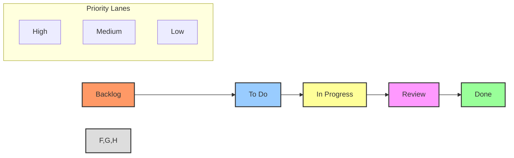
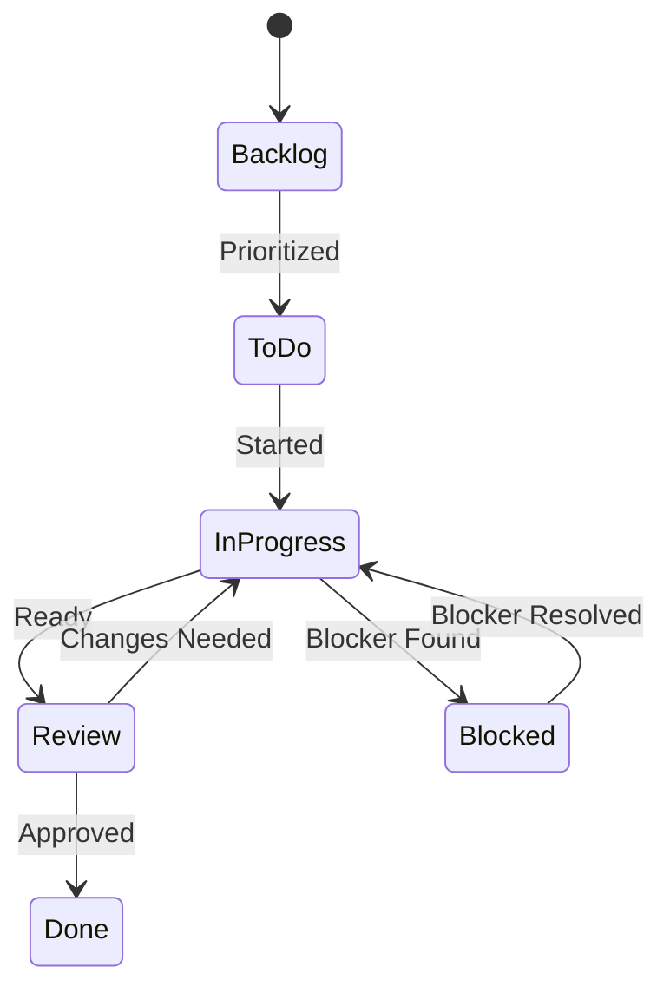

# 📊 Project Board Workflow Guide

## 📋 Table of Contents
- [Overview](#overview)
- [Board Structure](#board-structure)
- [Automation Rules](#automation-rules)
- [Status Management](#status-management)
- [Integration Points](#integration-points)
- [Examples](#examples)
- [Best Practices](#best-practices)

## 🔍 Overview

This guide details the automated project board workflow used in the Cursor AI x GitHub Project Automation Toolkit. It covers board setup, automation rules, status management, and integration with other project components.

## 📌 Board Structure

### Layout Diagram


### Column Configuration
```typescript
interface BoardColumn {
    name: string;
    type: 'todo' | 'in_progress' | 'done';
    automations: AutomationRule[];
    limits?: {
        min?: number;
        max?: number;
    };
}

const boardColumns: BoardColumn[] = [
    {
        name: 'Backlog',
        type: 'todo',
        automations: ['auto_label', 'auto_assign']
    },
    {
        name: 'To Do',
        type: 'todo',
        automations: ['auto_priority', 'auto_milestone'],
        limits: { max: 20 }
    },
    {
        name: 'In Progress',
        type: 'in_progress',
        automations: ['update_status', 'check_blockers'],
        limits: { max: 10 }
    },
    {
        name: 'Review',
        type: 'in_progress',
        automations: ['request_review', 'check_criteria'],
        limits: { max: 5 }
    },
    {
        name: 'Done',
        type: 'done',
        automations: ['update_docs', 'notify_stakeholders']
    }
];
```

## ⚙️ Automation Rules

### Status Transitions


### Automation Implementation
```typescript
class BoardAutomation {
    private rules: Map<string, AutomationRule>;
    
    async handleCardMove(card: Card, from: Column, to: Column): Promise<void> {
        const rules = this.getRulesForTransition(from, to);
        await Promise.all(rules.map(rule => rule.execute(card)));
    }
    
    async applyAutomations(card: Card): Promise<void> {
        const column = card.getCurrentColumn();
        const rules = column.getAutomationRules();
        
        for (const rule of rules) {
            if (await rule.shouldApply(card)) {
                await rule.execute(card);
            }
        }
    }
}
```

## 📊 Status Management

### Status Indicators
| Status | Emoji | Description | Automation |
|--------|-------|-------------|------------|
| Not Started | 🔴 | Task in backlog or todo | Auto-label |
| In Progress | 🟡 | Task being worked on | Update docs |
| Review | 🔵 | Task in review | Notify reviewers |
| Complete | 🟢 | Task finished | Update metrics |
| Blocked | ⭕️ | Task has blockers | Alert team |
| Verified | ✅ | Task tested & approved | Close issue |

### Status Handler
```typescript
class StatusHandler {
    async updateStatus(card: Card, newStatus: Status): Promise<void> {
        const oldStatus = card.getStatus();
        
        // Update card status
        await card.setStatus(newStatus);
        
        // Run status-specific automations
        await this.runStatusAutomations(card, oldStatus, newStatus);
        
        // Update documentation
        await this.updateDocumentation(card);
        
        // Notify relevant parties
        await this.sendNotifications(card, oldStatus, newStatus);
    }
}
```

## 🔌 Integration Points

### GitHub Integration
```typescript
class GitHubBoardIntegration {
    async syncWithProject(board: Board): Promise<void> {
        // Sync project columns
        await this.syncColumns(board);
        
        // Sync automation rules
        await this.syncAutomations(board);
        
        // Sync card statuses
        await this.syncCardStatuses(board);
    }
    
    async handleProjectEvent(event: GitHubEvent): Promise<void> {
        switch (event.type) {
            case 'card_moved':
                await this.handleCardMove(event);
                break;
            case 'issue_updated':
                await this.handleIssueUpdate(event);
                break;
            case 'pr_status_changed':
                await this.handlePRStatusChange(event);
                break;
        }
    }
}
```

### Documentation Integration
```typescript
class BoardDocIntegration {
    async updateTaskLog(card: Card): Promise<void> {
        const taskInfo = await this.extractTaskInfo(card);
        await this.updateTaskLogFile(taskInfo);
    }
    
    async generateStatusReport(): Promise<Report> {
        const cards = await this.getAllCards();
        return this.createStatusReport(cards);
    }
}
```

## 💡 Examples

### Card Movement Automation
```typescript
const boardManager = new BoardManager();

// Configure card movement handler
boardManager.addHandler('card.moved', async (event) => {
    const { card, fromColumn, toColumn } = event;
    
    // Update status
    await statusHandler.updateStatus(card, toColumn.getStatus());
    
    // Run column-specific automations
    await automationHandler.runColumnAutomations(card, toColumn);
    
    // Update documentation
    await docHandler.updateCardDocs(card);
});
```

### Priority Management
```typescript
const priorityManager = new PriorityManager();

// Configure priority rules
priorityManager.addRule('high_priority', {
    condition: (card) => card.hasLabel('urgent') || card.isBlocking(),
    action: async (card) => {
        await card.setPriority('high');
        await card.moveToTop();
        await notifier.alertTeam(card);
    }
});
```

### Status Report Generation
```typescript
const reportGenerator = new ReportGenerator();

// Configure daily status report
reportGenerator.addReport('daily_status', {
    schedule: '0 9 * * 1-5', // Every weekday at 9am
    generate: async () => {
        const cards = await board.getAllCards();
        const stats = await analyzer.generateStats(cards);
        
        return {
            inProgress: cards.filter(c => c.status === 'in_progress'),
            blocked: cards.filter(c => c.isBlocked()),
            completedToday: stats.getCompletedToday(),
            burndownChart: await charts.generateBurndown(stats)
        };
    }
});
```

## 🌟 Best Practices

1. **Column Management**
   - Keep WIP limits enforced
   - Regular backlog grooming
   - Clear definition of done

2. **Automation Rules**
   - Test rules before deployment
   - Monitor for unintended consequences
   - Document rule logic

3. **Status Updates**
   - Keep statuses current
   - Use consistent labels
   - Document status changes

4. **Integration**
   - Regular sync checks
   - Validate data consistency
   - Monitor error logs

## 🔗 Related Documentation
- [Task Workflow](task-workflow.md)
- [Documentation Workflow](documentation-workflow.md)
- [Integration Workflow](integration-workflow.md)

---

Made with Power, Love, and AI •  ⚡️❤️�� •  POWERBRIDGE.AI