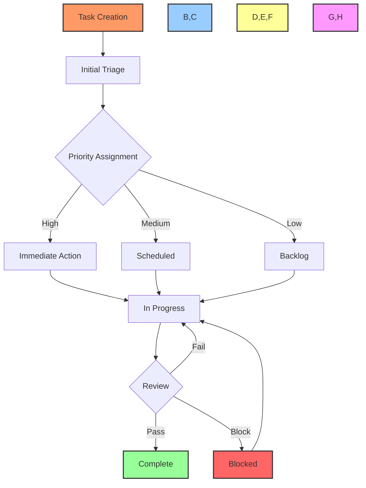
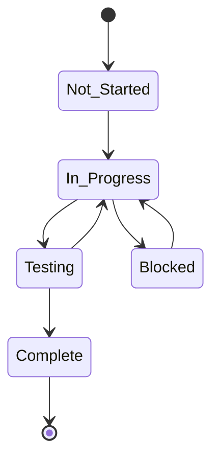

# 📋 Task Workflow Guide

## 📋 Table of Contents
- [Overview](#overview)
- [Task Lifecycle](#task-lifecycle)
- [Workflow Components](#workflow-components)
- [Automation Rules](#automation-rules)
- [Integration Points](#integration-points)
- [Status Management](#status-management)
- [Examples](#examples)

## 🔍 Overview

This guide details the automated task management workflow used in the Cursor AI x GitHub Project Automation Toolkit. It covers task creation, tracking, updates, and completion through GitHub Issues and Project boards.

## 🔄 Task Lifecycle

### Workflow Diagram


### Status Flow


## ⚙️ Workflow Components

### Task Creation
```typescript
interface TaskDefinition {
    title: string;
    description: string;
    priority: 'high' | 'medium' | 'low';
    labels: string[];
    assignees: string[];
    milestone?: string;
    dueDate?: Date;
}

class TaskCreator {
    async createTask(definition: TaskDefinition): Promise<Task> {
        const task = await this.github.issues.create({
            ...definition,
            template: this.getTemplate(definition.priority)
        });
        
        await this.initializeTaskTracking(task);
        return task;
    }
}
```

### Task Tracking
```typescript
interface TaskTracker {
    updateStatus(taskId: string, status: TaskStatus): Promise<void>;
    addComment(taskId: string, comment: string): Promise<void>;
    updateProgress(taskId: string, progress: number): Promise<void>;
    addBlocker(taskId: string, blocker: string): Promise<void>;
}
```

## 🤖 Automation Rules

### Priority-Based Routing
```typescript
const priorityRules = {
    high: {
        assignees: ['team-lead'],
        labels: ['priority-high', 'needs-review'],
        column: 'High Priority'
    },
    medium: {
        assignees: ['available-developer'],
        labels: ['priority-medium'],
        column: 'To Do'
    },
    low: {
        labels: ['priority-low'],
        column: 'Backlog'
    }
};
```

### Status Update Triggers
```typescript
const statusTriggers = {
    'in_progress': [
        updateProjectCard,
        notifyAssignees,
        updateDocumentation
    ],
    'blocked': [
        addBlockerLabel,
        notifyTeamLead,
        updateProjectCard
    ],
    'complete': [
        runTests,
        requestReview,
        updateDocumentation
    ]
};
```

## 🔌 Integration Points

### GitHub Projects Integration
```typescript
class ProjectBoardIntegration {
    private board: ProjectBoard;
    
    async moveTask(taskId: string, status: TaskStatus): Promise<void> {
        const column = this.getColumnForStatus(status);
        await this.board.moveCard(taskId, column);
    }
    
    async updateTaskCard(taskId: string, updates: CardUpdates): Promise<void> {
        await this.board.updateCard(taskId, updates);
    }
}
```

### Documentation Integration
```typescript
class DocumentationUpdater {
    async updateTaskStatus(task: Task, status: TaskStatus): Promise<void> {
        await this.updateTaskLog(task, status);
        await this.updateDevNotes(task, status);
        await this.updateProjectMetrics(task, status);
    }
}
```

## 📊 Status Management

### Status Indicators
| Emoji | Status | Description |
|-------|---------|-------------|
| 🔴 | Not Started | Task is defined but work hasn't begun |
| 🟡 | In Progress | Task is currently being implemented |
| 🟢 | Completed | Implementation is finished |
| ⭕️ | Blocked | Task cannot proceed due to dependencies |
| 🔵 | Testing | Implementation is being tested |
| ✅ | Verified | Task is completed and verified |

### Status Update Process
```typescript
class StatusManager {
    async updateStatus(task: Task, newStatus: TaskStatus): Promise<void> {
        // Validate status transition
        this.validateTransition(task.status, newStatus);
        
        // Update task
        await this.github.issues.update({
            ...task,
            status: newStatus,
            labels: this.getStatusLabels(newStatus)
        });
        
        // Trigger automations
        await this.runStatusTriggers(task, newStatus);
        
        // Update documentation
        await this.updateDocumentation(task, newStatus);
    }
}
```

## 💡 Examples

### Creating a High-Priority Task
```typescript
const task = await taskCreator.createTask({
    title: '[FEAT-001] Implement User Authentication',
    description: 'Add JWT-based authentication system',
    priority: 'high',
    labels: ['feature', 'security'],
    assignees: ['lead-dev'],
    milestone: 'v1.0'
});
```

### Handling Task Blockers
```typescript
const workflowHandler = new TaskWorkflowHandler();

await workflowHandler.handleBlocker({
    taskId: 'TASK-123',
    blocker: 'Waiting for API access',
    impact: 'high',
    mitigation: 'Implementing mock API for development'
});
```

### Automated Status Updates
```typescript
const automationEngine = new TaskAutomationEngine();

// Configure automation rules
automationEngine.addRule('pull_request_merged', async (context) => {
    const taskId = context.extractTaskId();
    await statusManager.updateStatus(taskId, 'complete');
    await documentationUpdater.updateTaskStatus(taskId, 'complete');
});
```

## 🔗 Related Documentation
- [Project Board Workflow](project-board-workflow.md)
- [Documentation Workflow](documentation-workflow.md)
- [Integration Workflow](integration-workflow.md)

---

Made with Power, Love, and AI •  ⚡️❤️�� •  POWERBRIDGE.AI