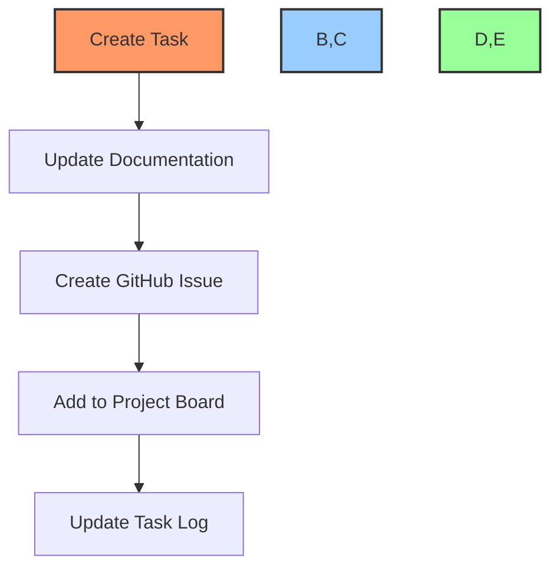

# 🔄 Task Creation Workflow Example

## 📋 Overview
This example demonstrates a complete task creation workflow using our automation toolkit.

## 🔄 Workflow Steps



## 📝 Example Implementation

### 1. Create Task Documentation
```markdown
# [TASK-001] Implement User Authentication

## Description
Add JWT-based user authentication system

## Requirements
- [ ] Login endpoint
- [ ] Token generation
- [ ] Refresh token handling
```

### 2. Create GitHub Issue
```bash
# Using MCP command
mcp_github_create_issue \
  -owner "[your-org]" \
  -repo "[your-repo]" \
  -title "[AUTH-001] 🔐 Implement User Authentication" \
  -body "Implementation of JWT-based authentication system..."

# Using GitHub CLI
gh issue create \
  --title "[AUTH-001] 🔐 Implement User Authentication" \
  --body "Implementation of JWT-based authentication system..."
```

### 3. Add to Project Board
```bash
# Add issue to project
gh project item-add [project-number] --owner [your-org] --url "issue_url"

# Set status
gh project item-edit [project-number] --id ITEM_ID --field Status --value "In Progress"
```

### 4. Update Task Log
```powershell
# Using PowerShell function
Update-TaskStatus -IssueNumber "001" -Status "In Progress" -Progress "0%"
```

## 📊 Example Files

### task-log.md
```markdown
## Current Tasks
- 🟡 [AUTH-001] Implement User Authentication
  - Status: In Progress
  - Progress: 0%
  - Created: 2024-01-20
```

### dev-notes.md
```markdown
## Authentication System
- Using JWT tokens
- Implementing refresh mechanism
- Security considerations documented
```

## 🔍 Validation Steps
1. Check documentation updates
2. Verify GitHub issue creation
3. Confirm project board status
4. Validate task log entries

## 🔗 Related Examples
- [Project Setup Example](../project-setup-workflow/)
- [Documentation Update Example](../documentation-workflow/)
- [Issue Management Example](../issue-management-workflow/)

---

Made with Power, Love, and AI •  ⚡️❤️🤖 •  POWERBRIDGE.AI 