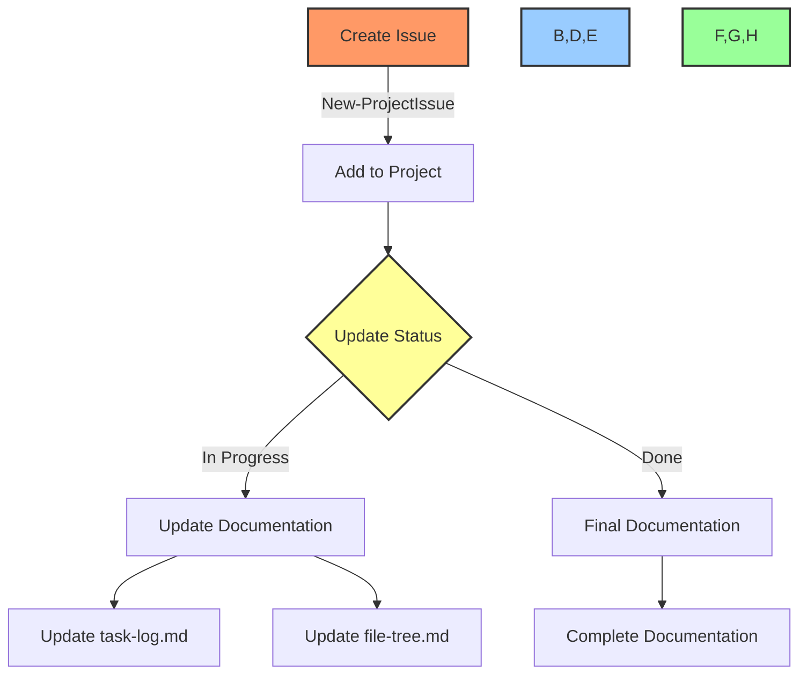
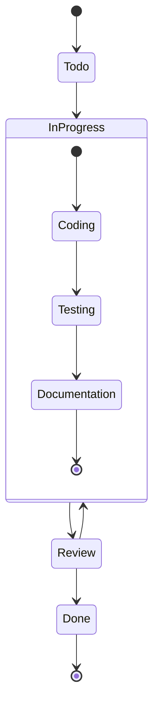

# 🔄 GitHub Project Management Workflow

## 📋 Table of Contents
- [🎯 Purpose](#purpose)
- [🛠️ Tools & Prerequisites](#tools--prerequisites)
- [📊 Project Management Commands](#project-management-commands)
- [🔄 Workflow Integration](#workflow-integration)
- [📝 Issue Templates](#issue-templates)
- [🚀 Automation Scripts](#automation-scripts)
- [📈 Project Status Management](#project-status-management)

## 🎯 Purpose

This document outlines the standardized workflow for managing GitHub issues and projects using MCP commands and GitHub CLI. The goal is to automate project management tasks and maintain consistent documentation across:
- Task List
- Task Log
- File Tree
- File Details
- Checkpoint Documentation

## 🛠️ Tools & Prerequisites

### Required Tools
- GitHub MCP Commands
- GitHub CLI (`gh`)
- PowerShell for automation scripts

### MCP GitHub Commands Available
```bash
# Issue Management
mcp_github_create_issue
mcp_github_get_issue
mcp_github_update_issue
mcp_github_add_issue_comment
mcp_github_get_issue_comments

# Project Integration (via GitHub CLI)
gh project
gh issue
```

## 📊 Project Management Commands

### 1. Issue Creation
```powershell
# Create new issue with MCP
function New-ProjectIssue {
    param(
        [string]$Title,
        [string]$Body,
        [string[]]$Labels,
        [string[]]$Assignees,
        [string]$ProjectNumber
    )
    
    # Create issue using MCP
    $issue = mcp_github_create_issue -owner "your-org" -repo "your-repo" -title $Title -body $Body -labels $Labels -assignees $Assignees
    
    # Add to project using GitHub CLI
    if ($ProjectNumber) {
        gh project item-add $ProjectNumber --owner "your-org" --url $issue.html_url
    }
    
    return $issue
}
```

### 2. Issue Status Management
```powershell
# Update issue status in project
function Update-IssueStatus {
    param(
        [string]$IssueNumber,
        [string]$Status,  # "Todo", "In Progress", "Done"
        [string]$ProjectNumber
    )
    
    # Map status to project field values
    $statusMap = @{
        "Todo" = "Todo"
        "In Progress" = "In Progress"
        "Done" = "Done"
    }
    
    # Update project status
    gh project item-edit $ProjectNumber --owner "your-org" --id $IssueNumber --field-value $statusMap[$Status]
}
```

### 3. Documentation Integration
```powershell
# Update documentation based on issue
function Update-Documentation {
    param(
        [string]$IssueNumber,
        [string]$Status
    )
    
    # Get issue details
    $issue = mcp_github_get_issue -owner "your-org" -repo "your-repo" -issue_number $IssueNumber
    
    # Update task-log.md
    Add-Content -Path "DEV/task-log.md" -Value @"
## Task Progress - $(Get-Date -Format "yyyy-MM-dd")

### Current Implementation
🎯 Task: [$($issue.number)] - $($issue.title)
📊 Status: $Status

#### Changes Made
$($issue.body)

See file-tree.md for component structure
See dev-notes.md for implementation details
"@
}
```

## 🔄 Workflow Integration

### Standard Workflow Process


## 📝 Issue Templates

### Standard Issue Template
```markdown
## 🎯 Task Description
[Detailed description of the task]

## 📋 Acceptance Criteria
- [ ] Criterion 1
- [ ] Criterion 2
- [ ] Criterion 3

## 🔍 Technical Details
- Component: [Component Name]
- Dependencies: [List dependencies]
- Estimated Effort: [1-5]

## 📊 Documentation Requirements
- [ ] Update task-log.md
- [ ] Update file-tree.md
- [ ] Update dev-notes.md
- [ ] Update file-details.md
```

## 🚀 Automation Scripts

### 1. Task Creation Script
```powershell
# Create task and update all documentation
function New-CompleteTask {
    param(
        [string]$Title,
        [string]$Description,
        [string[]]$Labels,
        [string]$ProjectNumber
    )
    
    # Create issue with template
    $body = Get-IssueTemplate -Type "Standard"
    $issue = New-ProjectIssue -Title $Title -Body $body -Labels $Labels -ProjectNumber $ProjectNumber
    
    # Update documentation
    Update-Documentation -IssueNumber $issue.number -Status "Todo"
    
    return $issue
}
```

### 2. Status Update Script
```powershell
# Update task status and documentation
function Update-TaskStatus {
    param(
        [string]$IssueNumber,
        [string]$NewStatus,
        [string]$ProjectNumber
    )
    
    # Update project status
    Update-IssueStatus -IssueNumber $IssueNumber -Status $NewStatus -ProjectNumber $ProjectNumber
    
    # Update documentation
    Update-Documentation -IssueNumber $IssueNumber -Status $NewStatus
}
```

## 📈 Project Status Management

### Status Workflow


### Status Commands
```powershell
# Quick status update commands
Set-TaskTodo     { param($IssueNumber) Update-TaskStatus -IssueNumber $IssueNumber -Status "Todo" }
Set-TaskProgress { param($IssueNumber) Update-TaskStatus -IssueNumber $IssueNumber -Status "In Progress" }
Set-TaskDone     { param($IssueNumber) Update-TaskStatus -IssueNumber $IssueNumber -Status "Done" }
```

## 📋 Integration with Core Documentation

### Documentation Update Order
1. Update `task-log.md` with progress
2. Update `file-tree.md` with new components
3. Update `file-details.md` with implementation
4. Update `dev-notes.md` with technical details
5. Update checkpoint documentation

### Cross-Reference Format
- In `task-log.md`: Reference issue numbers `[#123]`
- In `file-tree.md`: Link components to issues
- In `dev-notes.md`: Link technical decisions to issues

## ⚙️ Setup Instructions

1. Install GitHub CLI:
```bash
winget install GitHub.cli
```

2. Configure GitHub CLI:
```bash
gh auth login
```

3. Set up PowerShell profile:
```powershell
# Add to $PROFILE
. $PSScriptRoot/github-project-management.ps1
```

## 🔍 Usage Examples

```powershell
# Create new task
New-CompleteTask -Title "Implement Login Feature" -Labels @("feature", "frontend") -ProjectNumber "1"

# Update task status
Update-TaskStatus -IssueNumber "123" -NewStatus "In Progress" -ProjectNumber "1"

# Add comment with documentation update
Add-IssueComment -IssueNumber "123" -Comment "Updated task-log.md with implementation details"
```

---

Made with Power, Love, and AI •  ⚡️❤️🤖 •  POWERBRIDGE.AI