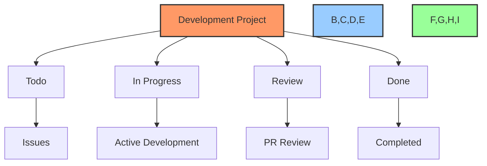
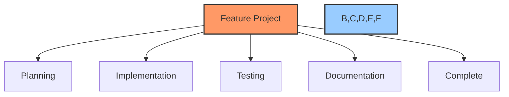
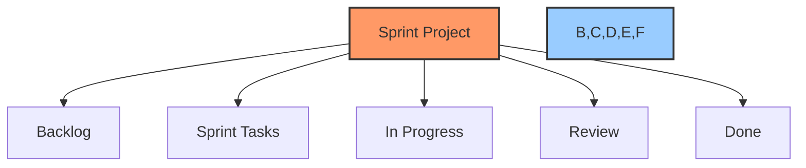

# 🚀 GitHub Project Creation Guide

## 📋 Table of Contents
- [🎯 Purpose](#purpose)
- [📊 Project Types](#project-types)
- [🔄 Creation Process](#creation-process)
- [📝 Templates](#templates)
- [🔍 Examples](#examples)

## 🎯 Purpose

This document provides a comprehensive guide for creating and configuring GitHub projects, including:
- Project type selection
- Template configuration
- Automation setup
- Integration with documentation

## 📊 Project Types

### 1. Development Project


### 2. Feature Project


### 3. Sprint Project


## 🔄 Creation Process

### 1. Project Setup Commands
```powershell
# Using MCP Commands
function New-GithubProject {
    param(
        [string]$Name,
        [string]$Type,
        [string]$Template
    )
    
    # Create project
    $project = mcp_github_create_project -owner "PowerBridge-ai" -name $Name
    
    # Configure based on type
    switch ($Type) {
        "Development" {
            Set-DevelopmentProjectConfig -Project $project
        }
        "Feature" {
            Set-FeatureProjectConfig -Project $project
        }
        "Sprint" {
            Set-SprintProjectConfig -Project $project
        }
    }
    
    return $project
}

# Using GitHub CLI
function New-GithubProjectCLI {
    param(
        [string]$Name,
        [string]$Type
    )
    
    # Create project
    gh project create --org "PowerBridge-ai" --name $Name
    
    # Configure columns based on type
    switch ($Type) {
        "Development" {
            gh project column create --project $Name --name "Todo"
            gh project column create --project $Name --name "In Progress"
            gh project column create --project $Name --name "Review"
            gh project column create --project $Name --name "Done"
        }
        "Feature" {
            gh project column create --project $Name --name "Planning"
            gh project column create --project $Name --name "Implementation"
            gh project column create --project $Name --name "Testing"
            gh project column create --project $Name --name "Documentation"
            gh project column create --project $Name --name "Complete"
        }
    }
}
```

### 2. Automation Setup
```powershell
# Configure project automation
function Set-ProjectAutomation {
    param(
        [string]$ProjectNumber,
        [hashtable]$Rules
    )
    
    foreach ($trigger in $Rules.Keys) {
        $action = $Rules[$trigger]
        
        # Create automation rule
        gh project automation create `
            --project $ProjectNumber `
            --name "$trigger -> $action" `
            --trigger $trigger `
            --action $action
    }
}

# Example usage
$rules = @{
    "issue.created" = "set status=Todo"
    "issue.closed" = "set status=Done"
    "pr.merged" = "set status=Done"
}

Set-ProjectAutomation -ProjectNumber "1" -Rules $rules
```

## 📝 Templates

### 1. Development Project Template
```yaml
name: Development Project
description: Standard development project with basic Kanban workflow

columns:
  - name: Todo
    type: automated
    rules:
      - when: issue.created
        set: status=Todo
  
  - name: In Progress
    type: automated
    rules:
      - when: issue.assigned
        set: status=In Progress
  
  - name: Review
    type: automated
    rules:
      - when: pr.created
        set: status=Review
  
  - name: Done
    type: automated
    rules:
      - when: issue.closed
        set: status=Done

labels:
  - name: bug
    color: d73a4a
  - name: enhancement
    color: a2eeef
  - name: documentation
    color: 0075ca
```

### 2. Feature Project Template
```yaml
name: Feature Project
description: Feature-specific project with detailed tracking

columns:
  - name: Planning
    type: manual
  
  - name: Implementation
    type: automated
    rules:
      - when: issue.labeled
        with: implementation
        set: status=Implementation
  
  - name: Testing
    type: automated
    rules:
      - when: issue.labeled
        with: testing
        set: status=Testing
  
  - name: Documentation
    type: automated
    rules:
      - when: issue.labeled
        with: documentation
        set: status=Documentation
  
  - name: Complete
    type: automated
    rules:
      - when: issue.closed
        set: status=Complete

labels:
  - name: implementation
    color: 0e8a16
  - name: testing
    color: fbca04
  - name: documentation
    color: 1d76db
```

## 🔍 Examples

### 1. Create Development Project
```powershell
# Create main development project
New-GithubProject `
    -Name "GainChain AI Development" `
    -Type "Development" `
    -Template "Basic Kanban"

# Configure automation
Set-ProjectAutomation -ProjectNumber "1" -Rules @{
    "issue.created" = "set status=Todo"
    "issue.assigned" = "set status=In Progress"
    "pr.created" = "set status=Review"
    "issue.closed" = "set status=Done"
}
```

### 2. Create Feature Project
```powershell
# Create feature project
New-GithubProject `
    -Name "GainChain AI - Trading Engine" `
    -Type "Feature" `
    -Template "Feature Tracking"

# Add custom fields
gh project field create `
    --project "GainChain AI - Trading Engine" `
    --name "Priority" `
    --type "single-select" `
    --options "High,Medium,Low"
```

## 🔍 Best Practices

1. **Project Setup**
   - Use consistent naming
   - Configure automation early
   - Set up required labels
   - Define clear columns

2. **Template Usage**
   - Start with base templates
   - Customize for project needs
   - Document modifications
   - Share improvements

3. **Integration**
   - Link to documentation
   - Configure webhooks
   - Set up notifications
   - Enable tracking

## 📋 Maintenance Tasks

### Initial Setup
- [ ] Create project
- [ ] Configure columns
- [ ] Set up automation
- [ ] Add labels
- [ ] Configure templates

### Regular Updates
- [ ] Review automation
- [ ] Update templates
- [ ] Clean up columns
- [ ] Verify integration

### Documentation
- [ ] Update workflows
- [ ] Record changes
- [ ] Share templates
- [ ] Document automation

---

Made with Power, Love, and AI •  ⚡️❤️🤖 •  POWERBRIDGE.AI