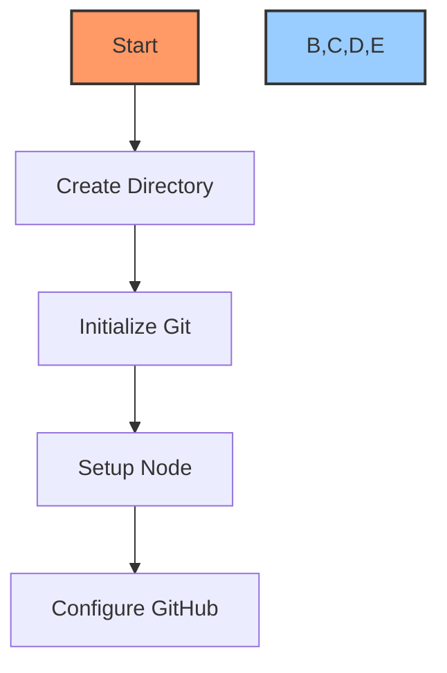
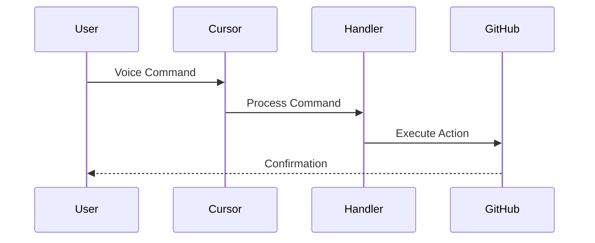
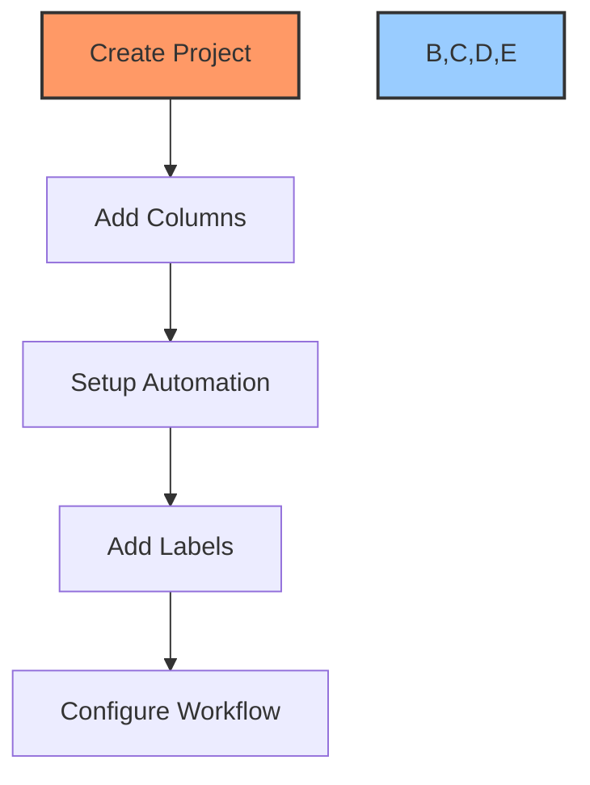

# 🚀 Project Creation Guide

## 📋 Table of Contents
- [Overview](#overview)
- [Prerequisites](#prerequisites)
- [Project Setup](#project-setup)
- [GitHub Integration](#github-integration)
- [Voice & Chat Setup](#voice--chat-setup)
- [Documentation Setup](#documentation-setup)
- [Project Board Setup](#project-board-setup)
- [Automation Setup](#automation-setup)
- [Testing & Verification](#testing--verification)
- [Troubleshooting](#troubleshooting)

## 🔍 Overview

This guide walks you through the process of creating a new project using the Cursor AI x GitHub Project Automation Toolkit. Follow these steps to set up a fully automated development environment with voice commands, chat integration, and GitHub project management.

## ✅ Prerequisites

Before starting, ensure you have:

1. **Required Tools**:
   - Cursor IDE installed
   - GitHub CLI (`gh`) installed
   - PowerShell 7+ installed
   - Node.js 18+ installed
   - [GitHub MCP Server](https://github.com/github/github-mcp-server) installed

2. **Configurations**:
   - GitHub account with access tokens
   - Cursor AI features enabled
   - Required permissions for GitHub operations

## 🏗️ Project Setup

### Initial Setup


1. **Create Project Directory**:
```bash
mkdir my-project
cd my-project
```

2. **Initialize Git**:
```bash
git init
git branch -M main
```

3. **Setup Node Project**:
```bash
npm init -y
```

4. **Install Dependencies**:
```bash
npm install @octokit/rest dotenv
```

## 🔗 GitHub Integration

### Repository Setup

1. **Create GitHub Repository**:
```bash
gh repo create my-project --private --clone
```

2. **Configure GitHub Settings**:
```bash
gh repo edit --enable-issues --enable-projects
```

3. **Setup Branch Protection**:
```bash
gh api repos/{owner}/{repo}/branches/main/protection \
  --method PUT \
  --field required_status_checks=null \
  --field enforce_admins=true \
  --field required_pull_request_reviews=null
```

## 🎤 Voice & Chat Setup

### Voice Command Configuration


1. **Initialize Voice Commands**:
```bash
./scripts/setup-voice-commands.ps1
```

2. **Configure Chat Integration**:
```bash
./scripts/setup-chat-prompts.ps1
```

## 📚 Documentation Setup

1. **Create Documentation Structure**:
```bash
mkdir -p docs/{technical,workflows,development,tutorials}
```

2. **Initialize Core Documents**:
```bash
cp templates/core/* docs/
```

3. **Update README.md**:
```bash
cp templates/readme-template.md README.md
```

## 📊 Project Board Setup

### Board Configuration


1. **Create Project Board**:
```bash
gh project create "Project Name" --org PowerBridge-ai
```

2. **Configure Columns**:
```bash
gh project column create --project "Project Name" \
  --name "To Do" \
  --name "In Progress" \
  --name "Review" \
  --name "Done"
```

## ⚙️ Automation Setup

### GitHub Actions

1. **Create Workflow Directory**:
```bash
mkdir -p .github/workflows
```

2. **Add Automation Workflows**:
```bash
cp templates/github/workflows/* .github/workflows/
```

3. **Configure Secrets**:
```bash
gh secret set GITHUB_TOKEN
```

## 🧪 Testing & Verification

### Verification Steps

1. **Test Voice Commands**:
```bash
./scripts/test-voice-commands.ps1
```

2. **Verify GitHub Integration**:
```bash
gh auth status
gh repo view
```

3. **Check Project Board**:
```bash
gh project view "Project Name"
```

## ❗ Troubleshooting

### Common Issues

1. **Voice Command Issues**:
   - Verify Cursor AI is enabled
   - Check microphone permissions
   - Restart Cursor IDE

2. **GitHub Integration Issues**:
   - Verify GitHub CLI authentication
   - Check access tokens
   - Confirm repository permissions

3. **Project Board Issues**:
   - Verify project visibility settings
   - Check organization permissions
   - Confirm workflow configurations

## 🔗 Related Documentation
- [Documentation Standards](documentation-standards.md)
- [Voice Command Guide](voice-commands.md)
- [GitHub Project Automation](github-project-automation.md)

---

Made with Power, Love, and AI •  ⚡️❤️🤖 •  POWERBRIDGE.AI