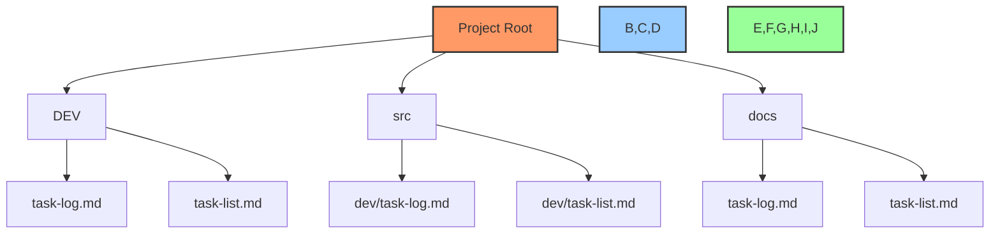

# 📋 Task Document Index

## 📋 Table of Contents
- [🔍 Overview](#overview)
- [📊 File Categories](#file-categories)
- [📝 Document Listing](#document-listing)
- [🔄 Update Process](#update-process)

## 🔍 Overview

This document maintains a comprehensive index of all task-related markdown files across the project, including:
- Task logs
- Task lists
- Project documentation
- Implementation details

## 📊 File Categories

### 1. Task Logs
Files that track task progress and updates:
```markdown
- DEV/task-log.md
- src/*/dev/task-log.md
- docs/task-log.md
```

### 2. Task Lists
Files containing task definitions and requirements:
```markdown
- DEV/task-list.md
- src/*/dev/task-list.md
- docs/task-list.md
```

### 3. Project Documentation
Supporting documentation files:
```markdown
- DEV/dev-notes.md
- src/*/dev/dev-notes.md
- docs/dev-notes.md
```

## 📝 Document Listing

### 🔄 Active Documents
Files currently being used and updated:



### 📊 Document Status

| Path | Type | Last Updated | Status |
|------|------|--------------|---------|
| `DEV/task-log.md` | TaskLog | [Date] | 🟢 Active |
| `DEV/task-list.md` | TaskList | [Date] | 🟢 Active |
| `src/dev/task-log.md` | TaskLog | [Date] | 🟡 In Progress |
| `docs/task-log.md` | TaskLog | [Date] | 🔵 Review |

## 🔄 Update Process

### Automatic Updates
This index is automatically updated by the directory scanning workflow when:
1. New task documents are created
2. Existing documents are modified
3. Documents are moved or renamed

### Manual Updates
To manually update this index:

```powershell
# Run directory scan
./DEV/_TOOLS/Update-TaskIndex.ps1

# Verify index
Get-Content ./DEV/_TOOLS/task-index.md | Select-Object -First 20
```

### Update Frequency
- 🔄 Automatic: Daily at midnight
- 🔄 On commit: Pre-commit hook
- 🔄 Manual: As needed

## 📋 Integration Notes

### 1. Project Management
- All indexed files are monitored for task updates
- Changes trigger project board updates
- Status is synced with GitHub issues

### 2. Documentation
- Cross-referenced with dev-notes.md
- Linked to implementation details
- Connected to checkpoints

### 3. Automation
- Integrated with CI/CD pipeline
- Automated index updates
- Status verification checks

---

Made with Power, Love, and AI •  ⚡️❤️🤖 •  POWERBRIDGE.AI