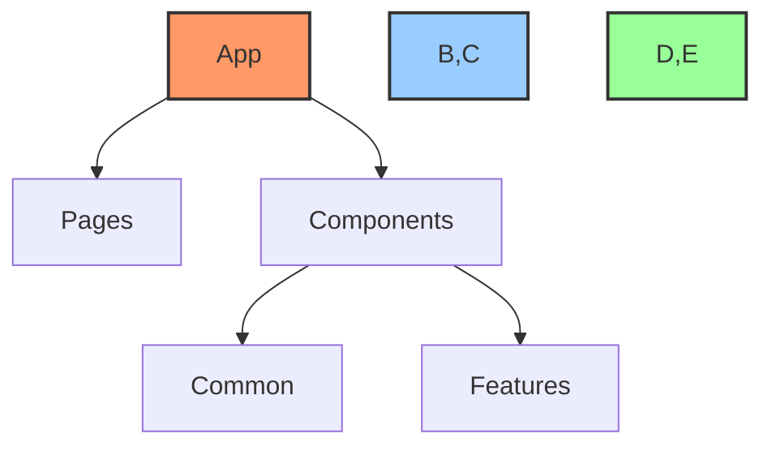
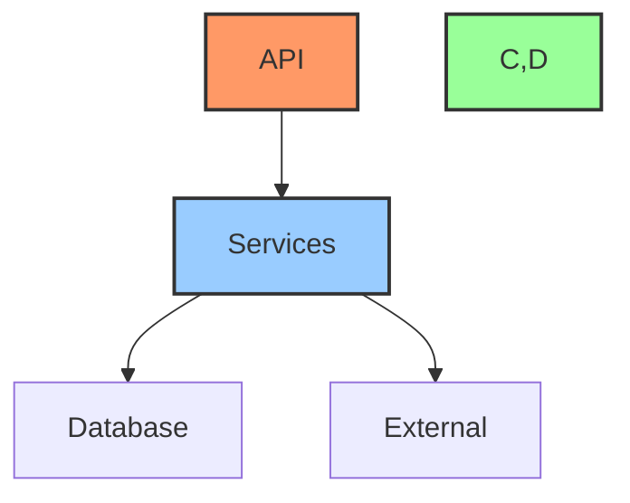
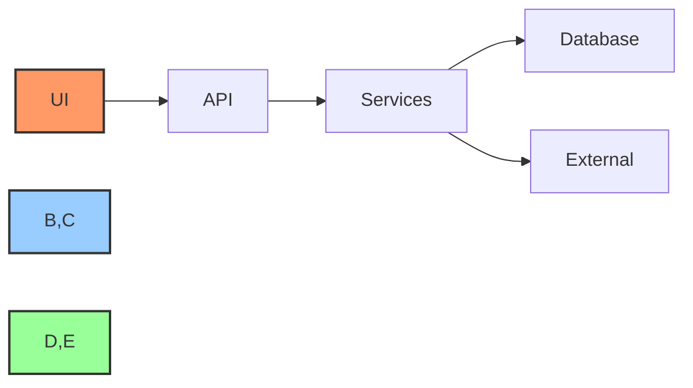
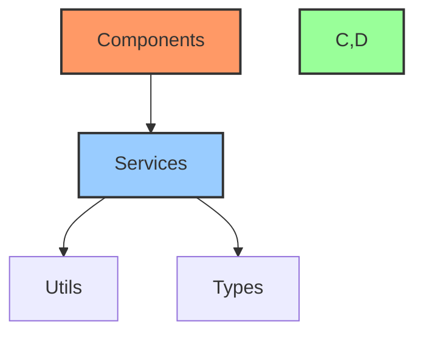

# 📂 [Project Name] - Project Structure

## 📋 Table of Contents
- [🔍 Overview](#overview)
- [📊 Component Status](#component-status)
- [🌲 Directory Structure](#directory-structure)
- [🔗 Component Relationships](#component-relationships)
- [📈 Implementation Status](#implementation-status)

## 🔍 Overview

This document outlines the file structure and organization of the [Project Name] project. It provides a comprehensive map of the codebase, highlighting key components, their relationships, and implementation status.

## 📊 Component Status Legend
- 🔄 MVP Component - Essential for initial release
- ⏳ Post-MVP Component - Planned for future releases
- 🔴 Not Started
- 🟡 In Progress
- 🟢 Completed
- ✅ Verified

## 🌲 Directory Structure

```
project-root/
├── src/                 # Source code
│   ├── components/      # UI components
│   │   ├── common/      # Shared components
│   │   └── features/    # Feature-specific components
│   ├── pages/          # Page components
│   ├── services/       # Business logic and services
│   ├── utils/          # Utility functions
│   └── types/          # TypeScript type definitions
├── tests/              # Test files
│   ├── unit/           # Unit tests
│   ├── integration/    # Integration tests
│   └── e2e/            # End-to-end tests
├── docs/              # Documentation
│   ├── api/           # API documentation
│   ├── guides/        # User guides
│   └── architecture/  # Architecture docs
└── scripts/           # Build and utility scripts
```

## 📦 Core Components

### 1. Frontend Components


#### Component Details
| Component | Status | Description | Dependencies |
|-----------|--------|-------------|--------------|
| `App` | 🟡 In Progress | Main application component | React, Router |
| `Pages` | 🔴 Not Started | Page components | Components |
| `Common` | 🟢 Completed | Shared UI components | Styles |
| `Features` | 🔴 Not Started | Feature-specific components | Common |

### 2. Backend Services


#### Service Details
| Service | Status | Description | Dependencies |
|---------|--------|-------------|--------------|
| `API` | 🟡 In Progress | REST API endpoints | Express |
| `Services` | 🔴 Not Started | Business logic | Database |
| `Database` | 🟢 Completed | Data access layer | PostgreSQL |
| `External` | 🔴 Not Started | External integrations | APIs |

## 🔗 Component Relationships

### Data Flow


### Dependencies


## 📈 Implementation Status

### MVP Components
| Component | Status | Progress | Notes |
|-----------|--------|----------|-------|
| Core UI | 🟡 In Progress | 60% | Basic components done |
| API | 🟡 In Progress | 40% | Endpoints defined |
| Database | 🟢 Completed | 100% | Schema implemented |
| Auth | 🔴 Not Started | 0% | Planning phase |

### Post-MVP Features
| Feature | Status | Priority | Notes |
|---------|--------|----------|-------|
| Analytics | ⏳ Planned | P2 | Future release |
| Admin Panel | ⏳ Planned | P1 | After MVP |
| Reporting | ⏳ Planned | P3 | Nice to have |

## 📊 Size & Metrics

| Component | Files | Lines of Code | Size |
|-----------|-------|---------------|------|
| Frontend | ~XX | ~XXXX | ~X.X MB |
| Backend | ~XX | ~XXXX | ~X.X MB |
| Tests | ~XX | ~XXXX | ~X.X MB |
| Docs | ~XX | ~XXXX | ~X.X MB |
| **Total** | **~XX** | **~XXXX** | **~X.X MB** |

## 🔄 Update Process

1. When adding new files:
   - Add to appropriate directory
   - Update component relationships
   - Update implementation status
   - Update metrics

2. When modifying structure:
   - Update directory tree
   - Update component diagrams
   - Update dependencies
   - Update metrics

3. Regular maintenance:
   - Review implementation status
   - Update progress metrics
   - Verify relationships
   - Clean up unused files

## 📚 Related Documentation
- [Link to dev-notes.md]
- [Link to task-log.md]
- [Link to architecture docs]
- [Link to API docs]

---

Made with Power, Love, and AI •  ⚡️❤️🤖 •  POWERBRIDGE.AI