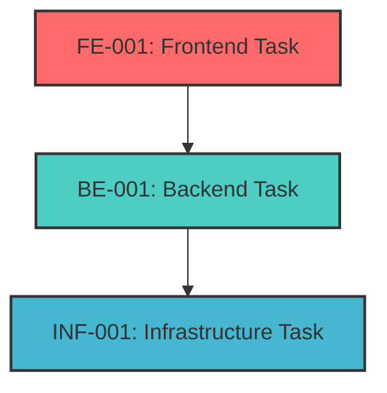
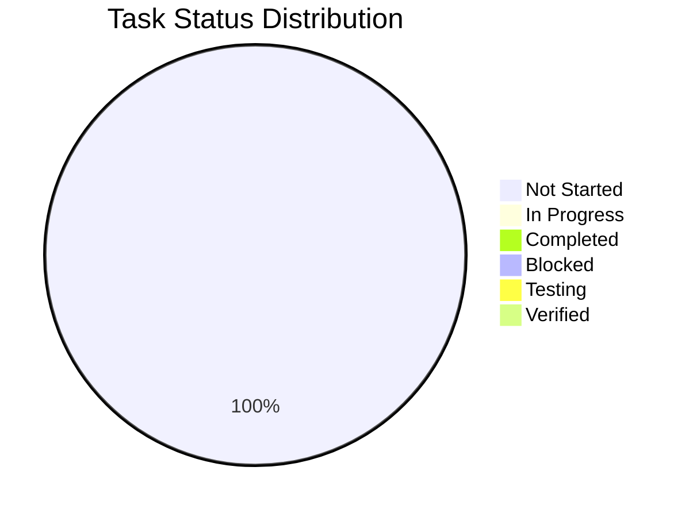
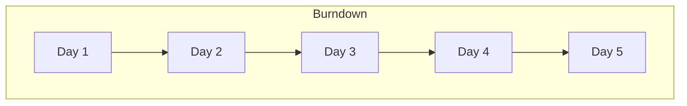
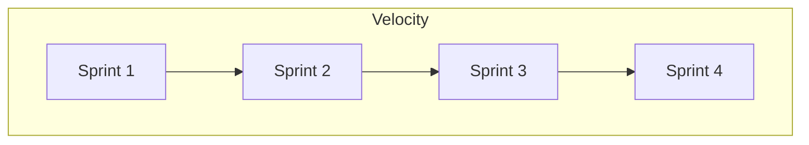

# 📋 Task List

## 📊 Task Overview

### Status Summary
- 🔴 Not Started: 0
- 🟡 In Progress: 0
- 🟢 Completed: 0
- ⭕️ Blocked: 0
- 🔵 Testing: 0
- ✅ Verified: 0

### Priority Distribution
- 🔥 Critical: 0
- ⚡ High: 0
- 📊 Medium: 0
- 🔽 Low: 0

## 🎯 Current Sprint Tasks

### Frontend Development
| ID | Task | Status | Priority | Dependencies | Due Date | Notes |
|----|------|--------|----------|--------------|----------|-------|
| FE-001 | Example Frontend Task | 🔴 Not Started | 🔥 Critical | BE-001 | YYYY-MM-DD | Initial setup |

### Backend Development
| ID | Task | Status | Priority | Dependencies | Due Date | Notes |
|----|------|--------|----------|--------------|----------|-------|
| BE-001 | Example Backend Task | 🔴 Not Started | ⚡ High | - | YYYY-MM-DD | API endpoint |

### Infrastructure
| ID | Task | Status | Priority | Dependencies | Due Date | Notes |
|----|------|--------|----------|--------------|----------|-------|
| INF-001 | Example Infrastructure Task | 🔴 Not Started | 📊 Medium | - | YYYY-MM-DD | Setup |

## 📝 Task Details

### [FE-001] Example Frontend Task
- **Description**: Detailed task description
- **Status**: 🔴 Not Started
- **Priority**: 🔥 Critical
- **Owner**: @username
- **Dependencies**: BE-001
- **Due Date**: YYYY-MM-DD

#### Acceptance Criteria
- [ ] Criterion 1
- [ ] Criterion 2
- [ ] Criterion 3

#### Technical Requirements
- Requirement 1
- Requirement 2
- Requirement 3

#### Implementation Notes
```markdown
- Note 1
- Note 2
- Note 3
```

#### Related Files
- `src/components/Example.tsx`
- `src/styles/example.css`

### [BE-001] Example Backend Task
- **Description**: Detailed task description
- **Status**: 🔴 Not Started
- **Priority**: ⚡ High
- **Owner**: @username
- **Dependencies**: None
- **Due Date**: YYYY-MM-DD

#### Acceptance Criteria
- [ ] Criterion 1
- [ ] Criterion 2
- [ ] Criterion 3

#### Technical Requirements
- Requirement 1
- Requirement 2
- Requirement 3

#### Implementation Notes
```markdown
- Note 1
- Note 2
- Note 3
```

#### Related Files
- `src/api/example.ts`
- `src/models/example.ts`

## 🔄 Task Dependencies



## 📈 Progress Tracking

### Sprint Progress
```mermaid
gantt
    title Sprint Timeline
    dateFormat  YYYY-MM-DD
    section Frontend
    FE-001 :a1, YYYY-MM-DD, 7d
    section Backend
    BE-001 :a2, after a1, 5d
    section Infrastructure
    INF-001 :a3, after a2, 3d
```

### Task Completion Rate


## 🚧 Blocked Tasks

### Current Blockers
| Task ID | Blocker Description | Impact | Resolution Plan | Status |
|---------|-------------------|---------|-----------------|--------|
| - | - | - | - | - |

## 📅 Upcoming Tasks

### Next Sprint Planning
| ID | Task | Priority | Dependencies | Estimated Start |
|----|------|----------|--------------|-----------------|
| FE-002 | Future Frontend Task | ⚡ High | FE-001 | YYYY-MM-DD |
| BE-002 | Future Backend Task | 📊 Medium | BE-001 | YYYY-MM-DD |

## 📝 Task History

### Completed Tasks
| ID | Task | Completion Date | Notes |
|----|------|----------------|-------|
| - | - | - | - |

### Task Updates
| Date | Task ID | Update Type | Description |
|------|---------|-------------|-------------|
| YYYY-MM-DD | FE-001 | Status Change | Started implementation |

## 🔍 Review Process

### Code Review Checklist
- [ ] Code follows style guide
- [ ] Tests are included
- [ ] Documentation is updated
- [ ] Performance impact considered
- [ ] Security implications reviewed

### Testing Requirements
- [ ] Unit tests
- [ ] Integration tests
- [ ] E2E tests
- [ ] Performance tests
- [ ] Security tests

## 📊 Metrics

### Sprint Metrics
- **Planned Story Points**: 0
- **Completed Story Points**: 0
- **Sprint Velocity**: 0
- **Burn Rate**: 0

### Quality Metrics
- **Code Coverage**: 0%
- **Bug Rate**: 0
- **Technical Debt Items**: 0

## 📈 Reports

### Sprint Burndown


### Velocity Trend


## 🔗 Related Documentation
- [Development Notes](./dev-notes.md)
- [File Tree](./file-tree.md)
- [API Documentation](./api-docs.md)
- [Test Documentation](./test-docs.md)

## 📝 Version History

| Version | Date | Changes |
|---------|------|---------|
| 1.0.0 | YYYY-MM-DD | Initial task list |

---

Made with Power, Love, and AI •  ⚡️❤️🤖 •  POWERBRIDGE.AI